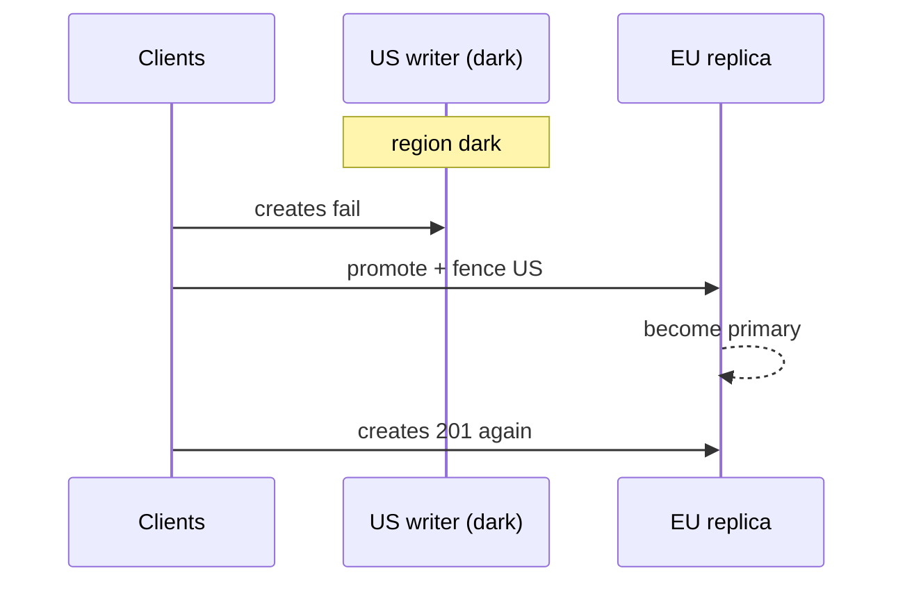
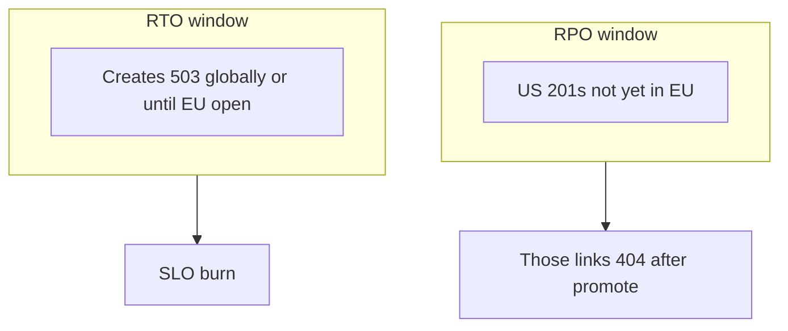

<!-- day-nav -->
[← Day 79 — Degradation under partial failure](79-degradation-under-partial-failure.md) · [Day 81 — Observability that pages a human →](81-observability-that-pages-a-human.md)

# Day 80 — Losing a region

**Do now**

1. Set a timer.
2. Attempt the problem. Stop at the attempt line. Do not scroll.
3. Then read.

## Time box

40 minutes.

| Minutes | Do this |
|---|---|
| 0–12 | Attempt. Region dark. RPO, RTO, who takes new writes. |
| 12–32 | Read. If both regions were writing and you have no fence, you have a split brain waiting. |
| 32–40 | Say RPO in seconds of data, RTO in minutes of create outage, and the authoritative side for new writes. |

## Intent

Facing a region that is already dark, leave able to state RPO, RTO, and which side is authoritative for new writes. Day 43 chose the topology while healthy. This day operates the failure: the writer region is gone, traffic still arrives, and someone will promote something.

## Problem

> Design a pastebin. People paste text and share a link.

The interviewer says: "US-East is dark. DNS still points some clients there. What is your RPO, what is your RTO, and who accepts new creates right now?"

## Attempt before reading

12 minutes. Do not scroll. Healthy design was **active-passive** with US writer, EU async replica (day 43 shape). Cross-region lag planning **~5 s**. Failover drill target **~5 minutes**. CDN is global. Idempotency keys live with the metadata primary. Bucket had async cross-region replication.

Write:

1. RPO for metadata and for bodies (seconds, or "unknown if replication was off").
2. RTO for creates and for reads.
3. Who is authoritative for new writes after the decision.
4. What you do about clients still hammering the dark region.
5. The fence: how the dark region is prevented from accepting writes if it flickers back.

---

**Stop. RPO, RTO, and authority are below. Do not change the attempt to match.**

---

## Requirements

**Region dark** means: no control plane, no data plane you trust in US-East. Not "one AZ." Not "high latency." Packets to that region fail or lie.

**In.**

- Name **RPO** (how much committed data you may lose) and **RTO** (how long until creates work again in a surviving region).
- Name the **authoritative writer** after failover.
- Fence the dead region.
- Say what users see during RTO.

**Assumptions.** Active-passive US→EU. Async WAL lag **5 s** healthy. Bucket replication on, same class lag. Peak creates **350/s**. Day 78 create SLO still matters: a long RTO burns budget fast.

**Out.** Inventing active-active merge in the first five minutes of an outage. Perfect RPO 0 without admitting sync cost. Kubernetes tutorial. Cost lecture as a substitute for a fence (day 82 is separate).

## Estimates

**RPO ~5 s** of metadata commits and unreplicated objects while healthy. At 350/s that is up to **~1,750** creates that returned 201 in US and never reached EU. Those users have links that will **404** after promotion unless you have another copy. Say the number. Do not say "async replication" without translating to lost acks.

**RTO ~5 minutes** for creates if the runbook is drilled: promote EU metadata, flip routing, fence US, verify bucket replica accept/GET path. Undrilled: **30–90 minutes** and you must say so. During RTO: creates **503**. CDN reads of objects already at edge: **200**. Origin misses that needed US bucket: fail until EU can serve objects.

Create SLO: 5 minutes at 350/s ≈ **105,000** failed creates — a large fraction of a 99.9%/month budget (day 78). Region loss is a budget-class event even when "reads still work."

## API and data

No new public API. Operational switches:

- Routing map / DNS / anycast: remove US origins.
- DB promote: EU replica becomes primary; old US epoch fenced.
- Idempotency: keys not in EU are gone with RPO; clients retry may create a **second** paste if they use a new key — prefer stable idempotency keys so a retry after failover either finds the promoted row or cleanly creates once in EU.

## Design

### Authority

**EU is the only writer** after the decision. Not "both until we know." Ambiguous authority is split brain: US heals, accepts creates, EU also accepts, idempotency forks, two pastes for one key or conflicting deletes.

### Failover sequence (interview depth)

1. **Declare.** US-East unusable. Incident commander (human or formal controller).
2. **Stop sending writes to US.** Drain or blackhole US create path immediately — even before EU promote — so you do not add to the lost set. Creates fail closed (**503**) globally for a short window if needed.
3. **Promote EU** metadata replica. Wait for promote success. Apply fence token / epoch so old US primary cannot commit if it returns (day 36 at region scale).
4. **Bucket.** Confirm EU region can GET replicated objects. Objects only in US and never replicated are **lost** (inside RPO, or worse if replication was misconfigured — admit "unknown").
5. **Open creates** on EU. RTO clock stops when a probe create in EU returns 201 and GET finds body.
6. **Reads.** Point origin at EU. CDN may still hold US origin hostnames — purge or update origin config so misses do not hang on dark US.

### What readers see

- Hot CDN paste: fine until TTL.
- Link created in the lost RPO window: **404** forever if it never replicated — this is the hard honesty of async. Do not call it "eventual."
- Link created earlier and replicated: works after origin flip.

### Active-active temptation during the outage

Turning on dual writers "just for this incident" without a merge rule creates a worse incident. If the healthy design was passive, **stay passive** through failover. Revisit topology after the postmortem (day 43 criteria).

### Staff depth: RPO is lost acks, RTO is create minutes

RPO ≠ "we have a replica." RPO = commits that returned success and will not exist on the promoted side. RTO ≠ "DNS TTL." RTO = minutes until a create succeeds on the surviving authority, including promote + fence + probe.

**Fence.** Without it, healed US is a second primary. Idempotency and deletes fork. Fence is part of RTO work, not an appendix.

**Sync RPO 0.** Every create waits for EU ack (+~150 ms) and EU death blocks US creates — coupled failure domain. Buy it only when lost 201s are unacceptable (payments-class). Pastebin usually keeps async and owns ~5 s.

**What staff sounds like.** Numbers for RPO/RTO. One writer. Fence. User-visible 503 during promote. Lost-ack 404 risk named.

## Diagrams

Caption: "Authority moves once. The dark region stays fenced when it returns."

Caption: "RPO hurts people who already got a link. RTO hurts everyone trying to save now."

## Failure the user sees

**During RTO.** Creator: 503. Reader: edge hits ok; some origin misses fail.

**After promote, lost RPO rows.** Creator thinks they saved; link 404s. Support needs the honesty: async cross-region loss.

**US flickers back without fence.** Duplicate creates, split deletes, silent corruption. This is the failure you refuse by fencing.

## Trade-offs

**Faster DNS TTL vs sticky clients.** Low TTL helps RTO but increases steady-state DNS load; connection pools may ignore DNS — need load balancer / anycast failaway, not only DNS.

**Automatic promote vs human gate.** Automatic is faster RTO, higher risk of promote on a brownout. Human gate is slower, safer for brownouts misdetected as dark. Say which you run.

**RPO 0 sync.** Latency and coupled outages vs never losing a 201.

## Talking points

**If they say "multi-region HA" without RPO.** "HA for whom? Creates or CDN reads? I need RPO and RTO numbers."

**If they keep US in the origin pool.** "Then RTO never ends. Pull it."

**If they want zero data loss and zero create downtime.** "That is sync active-active or a stretched primary — pick a different cost and failure story."

## Say this in the room

US-East is dark: our RPO is about five seconds of async lag — on the order of a couple thousand peak creates that may have returned 201 and will 404 after we promote. RTO for creates is about five minutes if the promote runbook is drilled: fence US, promote EU, flip origin, probe a create. During that window creates 503; edge reads still work. EU becomes the only writer; if US returns without a fence we risk split brain, so fencing is part of the failover, not a follow-up. I am not flipping to active-active in the middle of the incident.

### Staff depth: operate the topology you chose

Day 43 picked the cost. Day 80 spends it under fire. Numbers, authority, fence.

**What staff sounds like.** RPO in lost acks. RTO in create minutes. One primary. Fence.

## Runbook card (yes, in the interview)

1. Declare US dark.  
2. Pull US from create routing (immediate 503 better than silent black hole).  
3. Promote EU; attach fence/epoch.  
4. Confirm object path in EU.  
5. Probe create+GET.  
6. Open creates.  
7. Only then chase DNS stragglers and connection pools.

RTO is the clock from step 1 to step 6, not the time until a slide deck exists.

### Brownout vs dark

If US is 50% failing, automatic promote can split traffic wrongly. Prefer: shed US creates first (degrade), human confirms dark, then promote. Brownout mis-detected as dark is how you get two writers briefly — fence discipline still matters.

### Interviewer pushes

**"RPO zero."** Then creates wait for cross-region durability. EU death blocks US creates. Say the coupling. Pastebin usually refuses.

**"Clients retry with new ids."** After failover that creates duplicates for users who already got a 201 that never replicated. Prefer stable idempotency keys and document lost-ack 404s inside RPO.

## Kit artifact

| Follow-up | You answer with |
|---|---|
| "Region gone?" | RPO ~5s lost acks; RTO ~5m; EU writer; fence US; 503 during promote. |

## Design log

One line: your RPO, RTO, and authoritative writer after failover.

Next: [Day 81 — Observability that pages a human](81-observability-that-pages-a-human.md).

---

<!-- day-nav -->
[← Day 79 — Degradation under partial failure](79-degradation-under-partial-failure.md) · [Day 81 — Observability that pages a human →](81-observability-that-pages-a-human.md)
