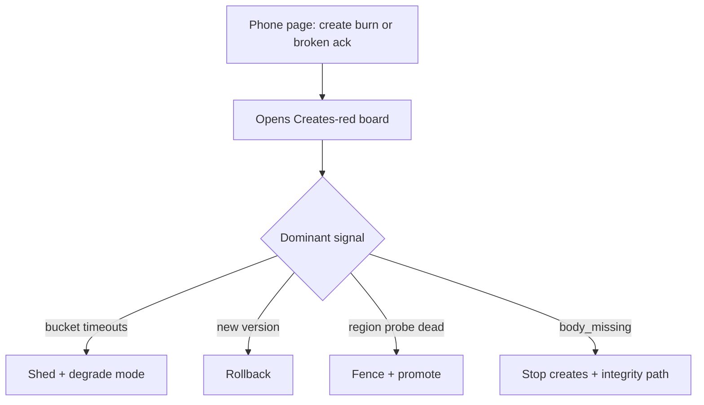
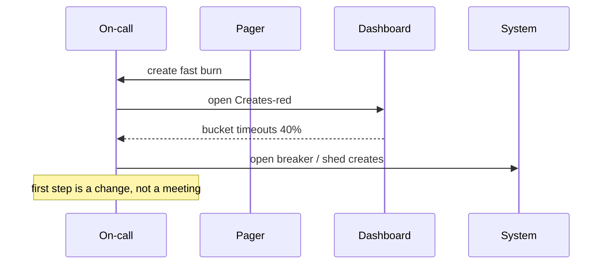

<!-- day-nav -->
[← Day 80 — Losing a region](80-losing-a-region.md) · [Day 82 — Cost as a spoken trade-off →](82-cost-as-a-spoken-trade-off.md)

# Day 81 — Observability that pages a human

**Do now**

1. Set a timer.
2. Attempt the problem. Stop at the attempt line. Do not scroll.
3. Then read.

## Time box

35 minutes.

| Minutes | Do this |
|---|---|
| 0–10 | Attempt. One failure you designed. Dashboard, page, first runbook step. |
| 10–28 | Read. If you only list tool brands, erase them and name the signal. |
| 28–35 | Say what pages, who wakes, first three checks, and what must not page. |

## Intent

Facing an on-call question, leave able to name the dashboard, the page, and the first runbook step for a failure you designed. Metrics without a human action are decoration. Staff signal is: the page means one failure mode, the dashboard answers the first questions, the runbook changes the system — not "look at graphs until inspiration."

## Problem

> Design a pastebin. People paste text and share a link.

The interviewer says: "It is 3 a.m. Creates are failing. What pages you, what do you open, and what is the first thing you do?"

## Attempt before reading

10 minutes. Do not scroll. You have create SLOs (day 78), degrade modes (day 79), and region failover (day 80). Bucket, primary, CDN, app tier, queue exist.

Write:

1. The **alert** that wakes a human (name the condition, not a product brand).
2. The **dashboard** panels you open first (3–5 signals).
3. The **first runbook step** that changes or confirms state (not "investigate").
4. One alert you **refuse** to send to a phone (ticket only).
5. How you tell "bucket down" from "app deploy bug" in two minutes.

---

**Stop. The page, the board, and the first step are below. Do not change the attempt to match.**

---

## Requirements

**In.**

- Page on **user-visible create failure** or **fast SLO burn**, not on raw CPU alone.
- Dashboard that separates **symptoms** (create success, latency) from **dependencies** (bucket errors, primary latency, saturation).
- Runbook step one is concrete: fence, flip, shed, rollback, or declare degrade.
- Trace or request-id story good enough to answer "is it one tenant or everyone?"

**Assumptions.** On-call is a human with laptop access. Metrics retention at 1-minute resolution for 48 hours is enough for the interview. Logs are searchable by `request_id` and `idempotency_key`.

**Out.** Building a full observability vendor comparison. Tracing every internal function. ML anomaly theaters. Log everything at debug in prod as a strategy.

## Estimates

At 350 creates/s, a **1%** fail rate is **3.5 misses/s ≈ 12,600/hour**. That may or may not fast-burn the monthly budget — check burn (day 78). Alert thresholds must live in **budget language** or **sustained symptom language**, not "error count > 10."

Phone pages more than **~2/week** per rotation train humans to ignore them. If your design pages on every blip, you designed noise, not operability.

**Staff arithmetic: pages per week.** At 350/s, a **1%** miss rate ≈ 3.5/s ≈ **12,600 misses/hour**. Whether that is fast burn depends on remaining budget (day 78) — a fresh month tolerates it longer than a month already 80% spent. Alert text must carry **burn hours-to-exhaust** or a sustained symptom window, not `error_count > 10`. If you page on CPU at 70% with green creates, you will silence the pager before the real Sev.

## API and data

Observability artifacts (interview-level):

- **SLI metrics:** `create_success`, `create_fail`, latency histogram; `row_exists_body_missing`.
- **Dependency metrics:** bucket PUT error/timeout rate; primary commit latency; app saturation (queue depth, worker utilization); CDN origin error rate.
- **Wide event / log:** one structured log per create with outcome, dependency that failed, region, request_id.
- **Trace:** client → app → bucket/primary spans; sampling ok if misses are oversampled.

## Design

### What pages (phone)

1. **Create success SLO fast burn** — projected budget exhaustion within 2 hours at current miss rate.
2. **Sustained create 5xx/timeout** — e.g. >5% for 5 minutes at nontrivial QPS (guard low-traffic noise).
3. **Broken-ack gauge** — any sustained `body_missing` after 201 > 0 for 2 minutes (correctness; page harder).
4. **Region unhealthy** — if you run multi-region probes: create probe failing in the writer region.

### What does not page (ticket / daytime)

- Single-instance CPU high with no user symptom.
- CDN cache hit ratio dips without origin errors.
- Queue lag for **delete detach** unless orphan age SLO exists.
- Disk warning on a node already draining.

### Dashboard: "Creates red" board

Top row (symptoms): create success rate, create p99, SLO burn remaining, broken-ack count.

Second row (deps): bucket PUT timeout %, primary commit p99, app shed rate / breaker state, region probe.

Third row (blast radius): failures by region, by build version, by largest tenant keys (cardinality-careful).

### First runbook steps (pick by board)

**If bucket timeouts dominate:** enter degrade (day 79): open breaker, confirm creates 503 fast, page storage owner, do **not** lengthen timeouts.

**If only new build shows fails:** rollback app. First step is rollback command / pipeline, not more logging.

**If primary commit red, bucket green:** failover to replica only if you designed it; else fail closed and escalate DB. Do not "restart all pods" as step one without a hypothesis.

**If one region dark:** day 80 runbook — fence, promote, flip. Dashboard should show region probe dead before you start.

**If broken-ack > 0:** stop creates (shed) until cause known; better 503 than more lying 201s. Then find whether PUT ack was false or row write skipped.

### Staff depth: page = decision, not anxiety

Every phone alert needs a **verb**: rollback, shed, promote, declare degrade, escalate to vendor. If the runbook says only "investigate," demote to ticket.

Correlation: `request_id` on client error page → log → which dependency span failed. Without that, 3 a.m. is guesswork across four dashboards.

**What staff sounds like.** Symptom alert, dependency split, first verb, refused noise.

## Diagrams

Caption: "The page encodes a hypothesis class; the board picks the verb."

Caption: "Step one changes exposure while the dependency is still sick."

## Failure the user sees

**Good page path.** Creates already failing; on-call sheds fast and shortens pain; status note if prolonged.

**Noise page path.** Humans silence alerts; real burn goes unheard — the failure mode of bad observability.

**Missing broken-ack page.** Users hold dead links while dashboards look "mostly green" on HTTP 201 rate alone.

**Dashboard tourism.** Twelve graphs, no verb. On-call scrolls while creates keep failing. The failure mode of observability without a runbook step.

**Auto-shed on a false burn.** Creates blocked for everyone because a low-QPS blip looked like fast burn. Guards: nontrivial QPS floor, multi-window confirm, easy kill switch back to accept.

**Alert says ErrorRateHigh.** No dependency hint, no playbook link, no burn hours. Human wakes into archaeology.

## Trade-offs

**Sensitivity vs fatigue.** Tight alerts catch sooner and train ignore. Use burn + sustained windows.

**High-card labels.** Per-paste ids on metrics explode cardinality (day 62). Keep labels coarse; put ids in logs.

**Auto-remediation.** Auto-shed on burn is powerful and dangerous (false positive blocks creates). Prefer auto-shed only with tight guards; auto-promote regions is scarier (day 80).

**Name the refusal inside each alternative.** Against CPU-only pages: you refuse noise that trains ignore. Against 201-counter health: you refuse hiding broken acks. Against "investigate" as step one: you refuse a page with no verb. Against per-paste metric labels: you refuse cardinality explosions (day 62). Against paging on every blip: you refuse a dead rotation.

## Talking points

**If they list Prometheus/Datadog only.** "Brand is fine. What signal pages a human for create failure?"

**If they page on CPU.** "Show me the user miss. CPU without symptom is a ticket."

**If first step is 'check Slack.'** "Slack is coordination. The runbook verb comes first."

**If first step is rollback vs shed.** "Board picks the verb: bucket timeouts → shed; new build owns errors → rollback; region probe dead → fence and promote; body_missing → stop creates."

**If they want one alert for everything.** "Split symptom burn from broken-ack. Correctness pages harder and must not wait on a mushy error average."

**If they skip request_id.** "Then 3 a.m. is four dashboards and a guess. Wide event with dependency that failed is the minimum."

## Say this in the room

Creates failing at 3 a.m. should page on SLO fast burn or sustained create misses, and separately on any broken-ack. I open a Creates-red board that splits symptoms from bucket, primary, shed state, and region probes. First step is a verb: shed or degrade if the bucket is timing out, rollback if the new version owns the errors, fence and promote if the writer region is dead. I will not phone-page on CPU alone, and I will not pretend a 201 counter is health without read-after-write checks.

### Staff depth: operability is part of the design

If you cannot name the page, you did not finish the design. Dashboard without a verb is tourism.

**What staff sounds like.** Alert condition. Board. First change. Noise you refused.

### More probes, with the answer

**"What pages?"** Create SLO fast burn and broken-ack — with playbook id in the alert text. **"What do you refuse?"** CPU-only phone pages; 201-without-GET as health; "investigate" as step one. **"What is the sensitive assumption?"** QPS floor and burn window — low traffic makes raw error % lie; budget remaining changes urgency. **"Where does the time go?"** Write the alert string and the first verb before naming vendors.

## Example alert text (write it)

> **PAGE** CreateSLOFastBurn: at current miss rate, 30d budget exhausts in <2h. create_success=91% over 15m. dominant_dep=bucket_put_timeout. playbook=degrade_object_store.

That string beats "ErrorRateHigh" because it names burn, window, dependency hint, and playbook.

### Two-minute differential diagnosis

| Board signal | Likely class | First verb |
|---|---|---|
| Bucket timeouts ↑, primary OK | Dependency slow/down | Shed / degrade |
| Errors only on build `2026.10.07.3` | Bad deploy | Rollback |
| Region A probe fail, B OK | Region loss | Fence + promote |
| 201 rate OK, body_missing ↑ | Broken ack | Stop creates + integrity |
| One tenant 90% of fails | Hot key / abuse | Fairness / isolate |

### Failure at grading altitude

| Board picture | Wrong first step | Staff first step |
|---|---|---|
| Bucket timeouts 40% | Lengthen PUT timeout | Open breaker / shed creates |
| Errors only on new build | Add more logs | Rollback |
| Region A probe dead | Wait on DNS | Fence + promote (day 80) |
| 201 OK, body_missing ↑ | Watch longer | Stop creates; integrity path |
| CPU high, creates green | Page the phone | Ticket; no user miss |

### Interviewer pushes

**"We'll AI-detect anomalies."** Still need a user-journey SLI and a verb. Anomaly on CPU is not an on-call strategy.

**"Log every field at debug."** Cost (day 82) and noise. Structured outcome logs + oversampled errors are enough for the whiteboard.

## Kit artifact

| Follow-up | You answer with |
|---|---|
| "What pages you?" | Create burn / broken-ack; Creates-red board; shed-rollback-promote verbs. |

## Design log

One line: the phone alert and the first runbook verb for create failure.

Next: [Day 82 — Cost as a spoken trade-off](82-cost-as-a-spoken-trade-off.md).

---

<!-- day-nav -->
[← Day 80 — Losing a region](80-losing-a-region.md) · [Day 82 — Cost as a spoken trade-off →](82-cost-as-a-spoken-trade-off.md)
