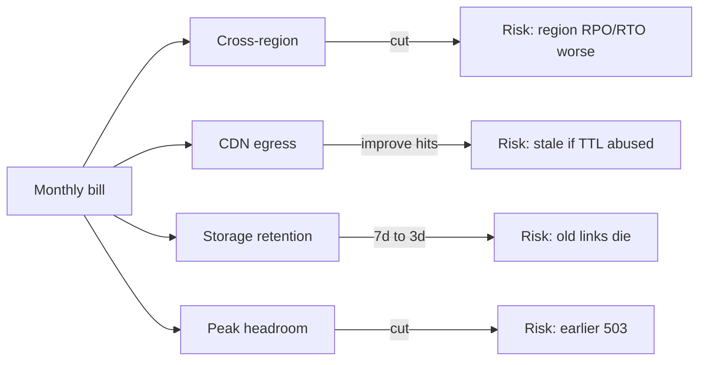
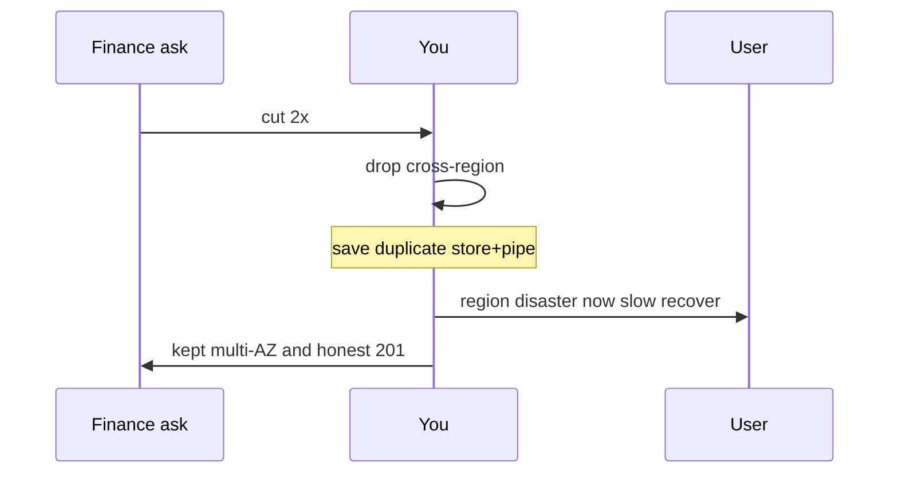

<!-- day-nav -->
[← Day 81 — Observability that pages a human](81-observability-that-pages-a-human.md) · [Day 83 — Migration while live →](83-migration-while-live.md)

# Day 82 — Cost as a spoken trade-off

**Do now**

1. Set a timer.
2. Attempt the problem. Stop at the attempt line. Do not scroll.
3. Then read.

## Time box

35 minutes.

| Minutes | Do this |
|---|---|
| 0–10 | Attempt. Cut spend. Name the user-visible risk you just bought. |
| 10–28 | Read. If your cut has no risk, you cut a fantasy line item. |
| 28–35 | Say what you removed, how much roughly, and the miss the user may see. |

## Intent

Facing a design that is correct and expensive, leave able to cut replicas, egress, or retention and say the user-visible risk. Cost is not a spreadsheet exercise in this interview. It is a trade-off sentence: money now versus a miss later. Staff credit is speaking the risk without being asked three times.

## Problem

> Design a pastebin. People paste text and share a link.

The interviewer says: "Finance says this is 2× what we can spend. Cut the bill without pretending the product is unchanged. What do you cut first?"

## Attempt before reading

10 minutes. Do not scroll. Rough monthly drivers you may assume: object storage for bodies, CDN egress, multi-AZ primary + replica, cross-region replica (day 43/80), app capacity for peak, 7-day retention, metrics/logs.

Write:

1. Top two cost drivers you believe (with a one-line why).
2. First cut and the **user-visible** risk.
3. Second cut and its risk.
4. One cut you **refuse** because it breaks a promise (SLO, durability ack, privacy).
5. What you need to measure to know the cut worked.

---

**Stop. The cuts and their risks are below. Do not change the attempt to match.**

---

## Requirements

**In.** Ordered cuts with risks. Keep create honesty (no fake 201). Keep an SLO story even if the target loosens on purpose. Prefer cutting **replicas, egress, retention, regions, chatty logs** before cutting correctness.

**Assumptions (order-of-magnitude, say they are guesses).** Bodies **100 GB/day** ingested; retention **7 days** ⇒ ~700 GB stored (+ erasure overhead). CDN egress dominates if pastes are hot publicly. Cross-region replica roughly doubles storage + adds sync/egress. Multi-AZ is cheaper than multi-region and usually non-negotiable for single-region HA.

**Out.** Negotiating a real cloud contract. Exact CUR line items. Greenwashing "we'll optimize later" with no cut. Replacing the design with a free hobby host.

## Estimates

Speak in ratios when dollars are unknown:

- Dropping **cross-region** replica: often saves a large fraction of storage+egress duplication; buys **RPO = whole region** on disaster (day 80 becomes "wait for US to return" or rebuild from backups with hours/days RPO).
- Cutting retention **7d → 3d**: ~half body storage; users lose older pastes — product change, must be explicit.
- CDN cache hit +50% relative: egress down; risk is serving **stale after delete** longer if you raise TTL carelessly.
- Halving app max replicas: shed sooner under peak; more 503 under day-24 10×; may burn SLO sooner.
- Logs/metrics high cardinality cut: invoice down; 3 a.m. diagnosis worse (day 81 tension).

You do not need exact dollars. You need **which invoice** and **which miss**.

## API and data

Cost cuts rarely change public API. They change **SLOs, TTLs, retention headers, and error rates under peak**. If you cut retention, `Expires` / product copy must change. If you cut region, status page and RPO docs change.

## Design

### Cut order (staff-shaped)

**1. Cross-region passive (if finance pressure is existential and product allows).**  
Save: duplicate storage, cross-region egress, idle capacity in region B.  
Risk: region loss RPO becomes **hours+** from backups, RTO longer; day 80 story weakens to backup restore.  
Say: "We accept a region-class disaster as rare and slow to recover."

**2. Lower CDN TTL or smarter cache keys — carefully.**  
Often you **raise** hit ratio with better cacheability; that saves egress. Raising TTL without delete invalidation increases **serve-after-delete**. Risk must be named. Saving egress by turning CDN **off** is usually backwards for public pastes.

**3. Retention 7 → 3 days** (product approval).  
Save: storage. Risk: broken old links. This is a product cut, not a silent ops tweak.

**4. Peak capacity headroom 3× → 1.5×.**  
Save: app/DB idle. Risk: earlier load shedding, more create 503 at spikes, faster SLO burn in incidents.

**5. Metrics/log sampling.**  
Save: observability bill. Risk: slower incident response; keep **broken-ack** and create SLI at full fidelity (day 81).

### Refuse these cuts

- **Single-AZ primary for "savings"** while still claiming HA. One AZ outage becomes total create+origin outage.
- **No durable store** (memory-only) while still returning 201.
- **Delete multi-AZ replica** and claim the same RPO.
- **Turn off idempotency store** to save a table — retries double-create.

### Staff depth: cost is a first-class trade-off sentence

Bad answer: "We'll use spot instances and optimize."  
Good answer: "Cut cross-region first; user risk is region disaster recovery in hours not minutes; keep multi-AZ; keep broken-ack metrics unsampled."

Tie to day 78: if you cut headroom, **loosen the SLO explicitly** or admit more burn risk. Silent tighter ops with same poster nines is dishonest.

**What staff sounds like.** Ordered cuts. Each with a miss. A refuse list. SLO updated if needed.

## Diagrams

Caption: "Every cut line has a user-visible risk on the right."

Caption: "Speak the risk to the user story, not only to the invoice."

## Failure the user sees

**After cross-region cut, region gone.** Long outage or restore from backup; possible large data loss vs old 5 s RPO.

**After retention cut.** Older shared links 404 — feels like data loss even though policy changed.

**After headroom cut.** Spike week: more save failures; SLO misses; angry creators.

## Trade-offs

**Save region money vs enterprise "multi-region" checkbox.** Marketing vs engineering honesty.

**Sample logs vs invoice.** Keep integrity signals full fidelity.

**Shorter retention vs growth of storage.** Product must own the breakage.

## Talking points

**If they cut AZ replica first.** "That is not a save; that is dropping HA while keeping the poster."

**If they say optimize code.** "Show the line item. Usually egress, storage, and idle HA dominate, not a for-loop."

**If they keep the same SLO after cutting headroom.** "Then we are lying on the poster. Change the SLO or keep the capacity."

## Say this in the room

I cut cross-region first if we must land near half on infrastructure that was duplicated for regional DR — the user-visible risk is that a region loss moves from minutes and seconds of RPO to a backup-shaped recovery. I keep multi-AZ and I keep honest create acks. Next I take product-approved retention reduction or peak headroom, each with more 404s on old links or more 503s on spikes, and I adjust the SLO if headroom dropped. I will not save money by faking durability or by silencing broken-ack metrics.

### Staff depth: money without risk is fiction

If the cut cannot hurt a user, it was not buying safety. Name the hurt.

**What staff sounds like.** First cut, first risk, refused cut, SLO honesty.

## Rough monthly driver story (order of magnitude)

For a public pastebin, invoices often rank like:

1. **CDN egress** if pastes go viral.
2. **Object storage + requests** for bodies.
3. **Idle HA** (extra AZ/region capacity).
4. **Observability** if cardinality is careless.
5. **App compute** — sometimes smaller than people think.

So "optimize the handler" rarely lands 2×. Cutting region and retention does.

### Couple cuts to SLO explicitly

| Cut | SLO / promise change |
|---|---|
| Drop cross-region | Region RTO/RPO worsen — rewrite DR story |
| Cut headroom 3×→1.5× | Expect more 503 at peak; maybe 99.9%→99.5% if product agrees |
| Retention 7→3d | Old links die — product changelog |
| Sample logs 100%→1% | Keep broken-ack at 100% |

### Interviewer pushes

**"Use spot for primary DB."** Risk of sudden primary loss — usually refuse for metadata truth.

**"One replica is enough globally."** Clarify AZ vs region. One AZ replica is not region DR.

## Kit artifact

| Follow-up | You answer with |
|---|---|
| "Cut the bill?" | Cross-region first; risk = worse RPO/RTO; keep multi-AZ; no fake 201. |

## Design log

One line: first cut and the user-visible risk.

Next: [Day 83 — Migration while live](83-migration-while-live.md).

---

<!-- day-nav -->
[← Day 81 — Observability that pages a human](81-observability-that-pages-a-human.md) · [Day 83 — Migration while live →](83-migration-while-live.md)
