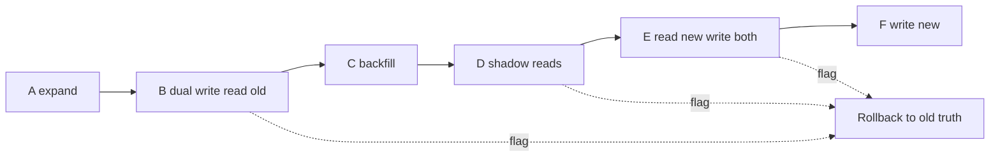
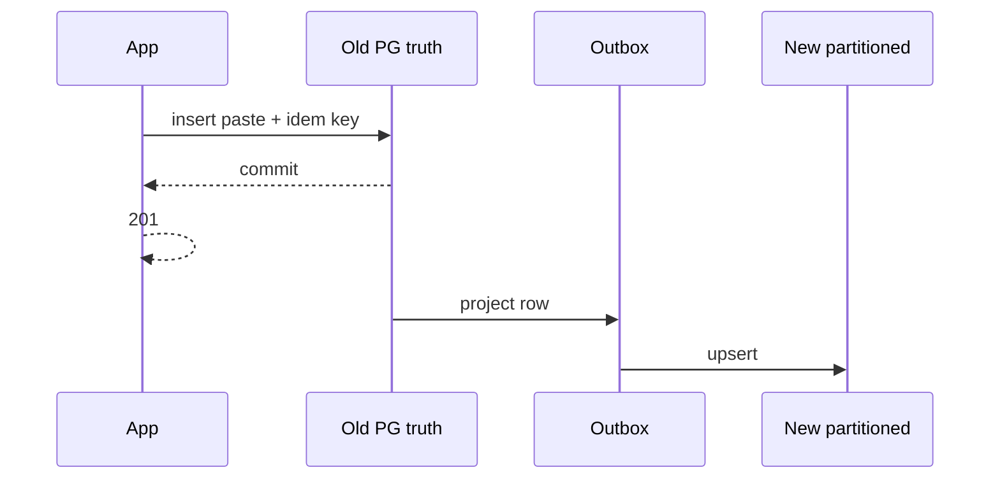

<!-- day-nav -->
[← Day 82 — Cost as a spoken trade-off](82-cost-as-a-spoken-trade-off.md) · [Day 84 — Mock: delivery dispatch →](84-mock-delivery-dispatch-with-a-late-failure.md)

# Day 83 — Migration while live

**Do now**

1. Set a timer.
2. Attempt the problem. Stop at the attempt line. Do not scroll.
3. Then read.

## Time box

40 minutes.

| Minutes | Do this |
|---|---|
| 0–12 | Attempt. Dual path. Rollback. Writes never stop. |
| 12–32 | Read. If cutover is a maintenance window with creates blocked for an hour, say the downtime — or design it away. |
| 32–40 | Say expand step, dual-write or dual-read rule, cutover gate, and rollback in one minute. |

## Intent

Facing a system that must change shape, leave able to migrate with a dual path and a rollback while writes continue. Schema expand/backfill was day 45. This day is **shape** change: new primary store, new key layout, or new region topology — under live creates. Staff signal is the dual path and the door back, not a big-bang night.

## Problem

> Design a pastebin. People paste text and share a link.

The interviewer says: "We must move paste metadata from a single primary Postgres to a partitioned store. Creates cannot stop. How do you migrate?"

## Attempt before reading

12 minutes. Do not scroll. Live creates **116/s** average, **350/s** peak. Reads: metadata for origin miss and for create ack checks. Idempotency keys must keep working across the move. Bodies stay in object storage. You may take a short **read-only** pause measured in seconds if you must — not an hour.

Write:

1. Expand: what you build first without deleting the old path.
2. How new writes reach both or one store during transition.
3. How reads choose a source without serving permanent 404 for live pastes.
4. Backfill: how old rows move; how you know it finished.
5. Cutover gate and **rollback** if the new store burns the create SLO.

---

**Stop. Dual path and rollback are below. Do not change the attempt to match.**

---

## Requirements

**In.**

- Online migration: creates keep succeeding under day 78 SLO (or a temporary explicit loosened target spoken aloud).
- Dual path with a clear **source of truth** at each phase.
- Backfill with progress and catch-up for the write tail.
- Rollback that does not require restoring from a week-old backup as the happy path.
- Idempotency continuity: a retry must not create two pastes because it landed on different stores.

**Assumptions.** Old store: single primary Postgres. New store: partitioned metadata (hash on `paste_id`). Object bodies unchanged. Cross-region issues out of scope unless you open them.

**Out.** Homegrown distributed transaction protocol lecture. Zero-risk migration fairy tale. Stopping writes for "just a few hours." Rehearsing vendor DMS clickpaths.

## Estimates

At 116/s, a **1-hour** write outage drops ~400k creates — unacceptable for this product story and deadly to a 99.9% budget. Even **60 seconds** of hard create downtime at peak is 21k misses. Design for **continuous writes**. Backfill of N million rows: quote a rate (for example 5k rows/s) and a wall clock; say you throttle so primary lag stays healthy.

**Staff arithmetic: downtime is a budget event.** 350/s × 60 s ≈ **21,000** peak misses per minute of big-bang cutover. A "short" 10-minute maintenance window ≈ **210,000** — most of a 99.9% month (day 78). Backfill at 5k rows/s for 50M rows ≈ **~2.8 hours** wall clock if you can sustain it; throttle when old primary lag or create p99 regresses. Dual-run cost (two stores) is the price of a flag rollback — buy the soak (day 82 tension, still buy it).

## API and data

Public API unchanged (`POST /pastes`, `GET /pastes/{id}`). Internal:

- Feature flag `metadata_store=old|dual|new` (day 75 shape) with kill switch back to `old`.
- Row version / `updated_at` for conflict detection during dual-write.
- Backfill checkpoint table: last key, lag, error count.

Idempotency key table migrates with the same phases — treat it as part of metadata truth, not an afterthought.

## Design

### Phase A — Expand (old still truth)

Stand up partitioned store. Deploy app code that can speak both APIs but still **reads and writes old only**. Shadow-validate: async sample reads compare old vs new when present (new mostly empty). No user traffic on new yet.

### Phase B — Dual write, read old

Every successful create **writes old synchronously** (truth) and **writes new** best-effort or synchronously. Prefer: write old + outbox event; worker writes new (day 39). If new lags, reads still old — users safe. If you dual-write sync and new is down, either fail create (couples availability) or queue the new write (accept lag). Interview pick: **outbox to new**, old remains truth.

Updates/deletes same pattern. Idempotency: commit key on old; project to new via outbox.

### Phase C — Backfill

Copy historical rows old→new by key ranges. Idempotent upserts. Track lag: `max(old.updated_at) - max(new.updated_at)` for done ranges. Re-run until lag near zero while dual-write keeps projecting live tail.

### Phase D — Dual read / shadow

Flip a fraction of **reads** to new with compare mode: read new, if miss fall back old, log divergence. Or read both and prefer old on conflict. Gate: divergence rate below threshold, create success unchanged, p99 ok.

### Phase E — Read new, write both (new becoming truth)

Reads prefer new; fall back old on miss for safety briefly. Writes still project both until confident.

### Phase F — Write new only (cutover)

Old becomes sink or stopped. Keep old read-only for hours/days for rollback. Then retire.

### Rollback

At any phase before F is solid: flag back to **read old, write old**. Outbox to new can drain or pause. Do not "rollback" by deleting the new cluster while it is truth without a reverse projection — hence old stays until soak completes.

If cutover already happened and new is corrupt: reverse projection new→old only if you kept dual events; else restore old from backup and accept RPO — say it before you need it. Prefer delaying cutover until rollback is still "flip the flag."

### Staff depth: truth moves once; flags move traffic

Migrations fail when two truths accept conflicting writes without a rule. Pick one truth per phase. Dual write is projection, not two equal primaries (day 43 lesson applied to stores).

Idempotency across cutover: key must be found on the truth you accept retries against. If a retry hits new before backfill of that key finished, and new returns "missing key → insert," you double — so either sticky read-old for idempotency until backfill done, or sync the idempotency row in the create path before ack.

**Create ack rule.** Still: do not 201 until **truth** durable. During dual-write-with-old-truth, old commit gates the 201. New lag never gates unless you promoted truth early.

**What staff sounds like.** Phased truth. Outbox projection. Backfill lag metric. Flag rollback. Idempotency continuity.

## Diagrams

Caption: "Rollback is a flag until new is the only truth. After that, rollback is a different disaster."

Caption: "201 follows old truth; new catches up without owning the ack yet."

## Failure the user sees

**New store down during dual-write.** Creates still succeed on old; projection backlog grows — page on outbox age (day 81). User does not see migration.

**Premature read-new with holes.** Intermittent 404 on live pastes — worst migration bug. Fall back old; abort traffic flip.

**Cutover without idempotency plan.** Retries create duplicates. User sees two links for one save intent.

**Big-bang night.** Scheduled create outage — user sees save failures; SLO burns by arithmetic.

**Outbox lag ignored.** New store hours behind; you flip reads anyway; intermittent 404 on live pastes. Worst migration bug class.

**Two truths accepting writes.** Conflict without a rule — active-active by accident across two stores (day 43 lesson).

**Rollback = restore last night's backup.** RPO measured in hours after you already deleted the dual path. Keep old until soak completes so rollback is a flag.

**Idempotency only on old after cutover started.** Retry hits new, key missing, second insert — user gets two links for one save intent.

## Trade-offs

**Sync dual write vs outbox.** Sync couples create latency/availability to new store; outbox lags new. Prefer outbox while old is truth.

**Long dual-run cost.** Paying two stores (day 82 tension) during soak — buy soak time anyway.

**Batch maintenance window.** Simpler engineering, explicit downtime product cost — usually refuse for create path at this QPS.

**Name the refusal inside each alternative.** Against hour-long write stops: you refuse a budget-class incident as a migration plan. Against two equal truths: you refuse conflict without a rule. Against backup-restore as happy-path rollback: you refuse hours of RPO. Against 201 on new while old is truth: you refuse lying acks. Against skipping idempotency continuity: you refuse double creates on retry.

## Talking points

**If they stop writes.** "At 350/s peak that is a budget-class incident. Dual path instead."

**If they dual-write with two truths.** "Who wins on conflict? Pick one truth per phase."

**If rollback is 'restore backup.'** "That is RPO measured in hours. Keep old until soak is done so rollback is a flag."

**If they skip shadow reads.** "Then the first traffic flip is the experiment. Shadow with fallback until divergence is boring."

**If they dual-write sync and new is down.** "You coupled create availability to the store you are still proving. Outbox while old is truth."

**If cutover already happened and new is corrupt.** "Reverse project only if you kept events; else backup RPO — say that risk before you flip truth."

## Say this in the room

We expand the partitioned store first while Postgres stays the truth. Creates keep committing on Postgres and project through an outbox into the new store; the 201 still waits only on Postgres so we never lie. Backfill copies history until lag is near zero, then we shadow reads, then shift reads, then shift writes — each step behind a flag that can send traffic back to Postgres in a minute. Idempotency keys stay on the current truth so retries do not fork. I am not taking an hour of create downtime to move metadata. Gate metrics (outbox lag, divergence, create success) block each flip; failing a gate means stay or roll the flag back, not push through.

### Staff depth: migration is operability under change

Same as day 45 expand/backfill, but for store shape. Truth, projection, soak, flag rollback.

**What staff sounds like.** Dual path. Gate metrics. Rollback before cutover hardens.

### More probes, with the answer

**"What pages?"** Outbox lag to new, shadow divergence, create success regression — not only new-store CPU. **"What do you refuse?"** Hour write windows at this QPS; two truths; backup as happy rollback; 201 before truth durable. **"What is the sensitive assumption?"** Backfill rate vs primary lag — throttle or you migrate by taking prod down quietly. **"Where does the time go?"** Truth-per-phase and flag rollback before debating partition keys.

## Gate metrics before each flip

| Gate | Threshold idea |
|---|---|
| Outbox lag to new | < 5s p99 for 30m |
| Backfill completion | 100% ranges + lag < 5s |
| Shadow divergence | < 0.01% miss/mismatch |
| Create success | No regression vs baseline |
| Create p99 | No material regression |

Fail any gate → do not advance phase; rollback flag if already advanced.

### Idempotency continuity checklist

- Key table phase matches paste truth phase.  
- Accept-create path reads keys from **truth**.  
- After cutover, old key store read-only for soak.  
- Never 201 on new if truth is still old.

### Phase card (draw this)

| Phase | Truth | Creates | Reads | Rollback |
|---|---|---|---|---|
| A expand | Old | Old | Old | N/A |
| B dual write | Old | Old + outbox→new | Old | Flag: stop projecting |
| C backfill | Old | Old + outbox | Old | Flag |
| D shadow | Old | Old + outbox | Prefer old; sample new | Flag |
| E read new | Old (writes) | Both | Prefer new; fall back old | Flag still cheap |
| F write new | New | New | New | Harder — old read-only soak |

### Failure at grading altitude

| Situation | Wrong answer | Staff answer |
|---|---|---|
| Must move metadata | Friday night writes off | Dual path; continuous writes |
| New store empty | Flip reads now | Backfill + lag gate + shadow |
| Bad cutover | Restore week-old backup | Flag back to old while dual path lives |
| Retry after cutover | New id each try | Idempotency on current truth |

### Interviewer pushes

**"Dual write both as truth."** Conflict rule? Without one, you built day 43 active-active by accident on two stores.

**"Cut over Friday night with writes off."** Compute miss count; usually refuse at this QPS unless product schedules it as an incident.

## Kit artifact

| Follow-up | You answer with |
|---|---|
| "Migrate live?" | Old truth + outbox project; backfill; flag rollback; 201 only on truth. |

## Design log

One line: your truth-per-phase plan and the rollback switch.

Next: [Day 84 — Mock: delivery dispatch with a late failure](84-mock-delivery-dispatch-with-a-late-failure.md). Closed book — not the SLO, region, or migration lectures.

---

<!-- day-nav -->
[← Day 82 — Cost as a spoken trade-off](82-cost-as-a-spoken-trade-off.md) · [Day 84 — Mock: delivery dispatch →](84-mock-delivery-dispatch-with-a-late-failure.md)
