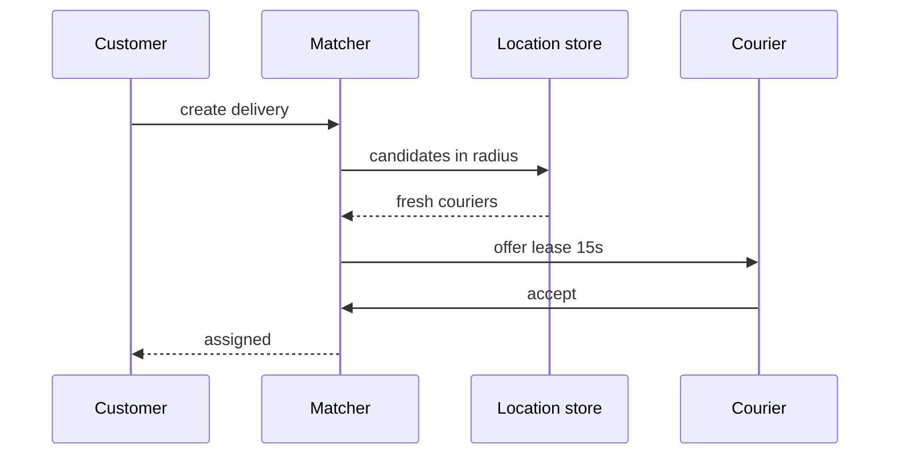
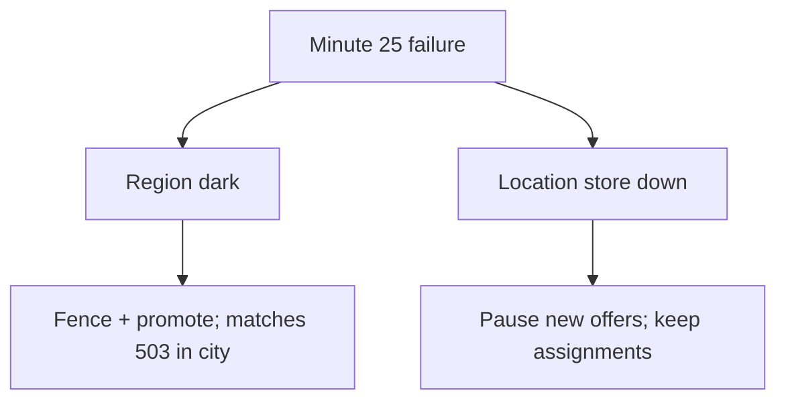

<!-- day-nav -->
[← Day 83 — Migration while live](83-migration-while-live.md) · [Day 85 — Kit hookup →](85-kit-hookup-and-the-design-log.md)

# Day 84 — Mock: delivery dispatch with a late failure

**Do now**

1. Set a timer.
2. Attempt the problem. Stop at the attempt barrier.
3. Then read.

## Time box

35 minutes for the attempt, then 10 minutes to score and log. The 10 minutes are not part of the interview clock. Do not use them to keep designing.

## Intent

Facing a dispatch problem that is not an SLO or migration lecture, leave able to design matching and, near minute 25, lose a region or the location store.

## How to run

- Blank paper. No notes, no days 78–83 as a checklist of buzzwords, no search, no chat.
- The only card you may have open is the [delivery dispatch problem](../prompts/delivery-dispatch.md) in the problem bank (`prompts/`). It does not help you.
- Do not scroll past the attempt barrier. The rubric is above the barrier so you can score. The design is below it.
- This is not an SLO poster day, not a cost spreadsheet day, and not a live migration day. If you notice yourself only listing nines or dual-write phases with no dispatch matching, stop and design dispatch. Near minute 25 the interviewer will kill a dependency — leave time.
- Timer visible. At zero you stop, even mid-arrow.
- Score, then write the log from **your** page, then scroll.

Score what the product does. A complete page says how a delivery request finds a courier, how location is used, what happens when no courier accepts, and what users see when a region or the location store dies mid-interview. If matching is missing, log the gap. Do not scroll to find it.

If you already scrolled, close the page. Run the mock tomorrow from memory, or it measures nothing.

## Timer

| Clock | You are doing | You are not doing |
|---|---|---|
| 0:00–5:00 | Request delivery, match courier, track, cancel. Non-goals. | An SLO lecture with no product |
| 5:00–10:00 | Orders/day, couriers online, match latency, location update rate. Peak. | Pastebin create QPS from muscle memory |
| 10:00–16:00 | API and keys: order, courier, offer, location. | Schema migration expand/backfill as the design |
| 16:00–25:00 | Match path vs location path vs assign path. | Cost cuts as the only deep dive |
| 25:00–33:00 | **Late failure:** lose a region **or** the location store. User-visible behavior. | Ignoring the failure to polish boxes |
| 33:00–35:00 | What you did not build, and the 10× break. | A second product |

## Problem

> Design a delivery dispatch system.
>
> Customers request a pickup and dropoff. The system offers the job to nearby couriers, assigns one, and tracks the delivery. Couriers move. Near minute 25 your interviewer will take something away — a region or the live location store. Keep designing through that.

That is the entire problem. Thirty-five minutes. Blank page. No notes.

## Rubric

Same six dimensions as day 7. Score 1–4 from your page only. A senior-shaped interview is mostly 3s. A staff-shaped interview is a 4 on the deep dive and a 4 on failure, not more boxes.

### Requirements

| Score | Anchor |
|---|---|
| 1 | Components first. No non-goals. |
| 2 | Behaviors listed. Constraints are adjectives. |
| 3 | Behavior, constraints, and non-goals locked before the design. The questions you asked would have changed matching. |
| 4 | As a 3, and each non-goal is a product you refused, with a reason. |

### Estimates

| Score | Anchor |
|---|---|
| 1 | No numbers, or one QPS with no numerator. |
| 2 | Numbers exist. Units or assumptions are missing. |
| 3 | Orders, couriers online, location updates, match latency budget. Average and peak. Assumptions spoken. |
| 4 | As a 3, plus the assumption you trust least, and a 10× move tied to a named limit. |

### API and data

| Score | Anchor |
|---|---|
| 1 | No API. The database brand is the model. |
| 2 | Endpoints exist. Offer/assign keys or location freshness are vague. |
| 3 | Request, offer, accept/reject, assign, location update, cancel. Real keys. Defined double-assign rule. |
| 4 | As a 3, plus idempotent accept, and a distinction you refused to blur (offer vs assign vs start). |

### Design

| Score | Anchor |
|---|---|
| 1 | A technology tour, or boxes that ignore the numbers. |
| 2 | A plausible system where every courier is scanned globally each request, or location is queried without a freshness bound. |
| 3 | The smallest design that meets the numbers. Geo-bounded candidate set, offer lease, single assignee. |
| 4 | As a 3, and you can say what the customer sees when no courier accepts before the SLA. |

### Deep dive

| Score | Anchor |
|---|---|
| 1 | You cannot go past the boxes. |
| 2 | Under a push, the answer is a product name. |
| 3 | One dive, with a choice and a cost. |
| 4 | The dive uses arithmetic or a concrete fault. You can name what it did not solve. |

### Failure and ops

| Score | Anchor |
|---|---|
| 1 | "We'll have replicas," and no user-visible behavior. |
| 2 | A dependency is named. Impact is fuzzy. |
| 3 | Region or location store down (the late failure). What customer and courier see. What still assigns. What you page on. |
| 4 | As a 3, plus the crash window you still have after the mitigation you drew. |

Do not average these into one vanity number. The log wants the six scores and **one** gap.

## Attempt first

Do the 35 minutes now. When the interviewer (or your timer note) hits ~25:00, pick **one**: writer region dark, **or** live location store unavailable. Overlay it. Do not restart the whole design.

When the timer stops:

1. Score the six dimensions from the anchors above. Evidence is a phrase on your paper.
2. Copy [design-log/TEMPLATE.md](../design-log/TEMPLATE.md) somewhere private. Fill it from your attempt. Scores are final once written.
3. Only then cross the barrier.

---

# Attempt barrier

You are about to read a reference design for delivery dispatch, including a late failure overlay.

If your timer has not hit zero, go back up. If your design log is not filled, go back up. Below is a reference, not an SLO lecture and not a migration plan. Use it for one amendment line. Do not edit the scores.

---

## Reference design

One legal design, at interview depth. Yours can differ and still be a 3. It is not a 3 if two couriers can both hold an exclusive assign, if matching scans every courier on earth, if location has no freshness bound, or if the late failure has no user-visible story.

### What this is not

Not day 78 SLO poster as the product. Not day 80 as a pure lecture without dispatch. Not day 82 cost sheet. Not day 83 store migration. Not day 61 ticket seats. Not day 60 nearby as a social app. Not day 49 warehouse inventory. Dispatch is **offer → accept → assign → track** for moving couriers.

### Requirements

**In.** Customer creates a delivery (pickup, dropoff, time window). System finds nearby available couriers, **offers** the job (lease), courier accepts or rejects, exactly **one** assignee, track progress, cancel rules. Location updates from couriers while online. Match within a latency budget the customer feels (planning: **offer started < 10 s** after request under normal load).

**Assumptions.** City-scale launch: **50k** deliveries/day (~0.6/s average, **~6/s** peak city). **5,000** couriers online peak. Location updates **1/s** per on-shift courier ⇒ **~5k/s** location writes peak. Candidate search radius **3 km**. Offer lease **15 s**. Idempotent accept keyed by `(offer_id, courier_id)`.

**Out.** Full multi-city optimization research, dynamic pricing ML, routing ETA ML thesis, messenger chat deep dive, payments capture (assume authorized), warehouse batching (day 49).

**Codes.** Two accepts on one offer: one wins assign, the other gets `already_taken`. Stale location older than **30 s**: courier not eligible for new offers. Cancel after pickup: different policy than cancel before assign — say both.

### Estimates

Location firehose dominates writes: 5k/s. Store for locations must be partitioned / in-memory-friendly (Redis-shaped or similar) with TTL; durable order state in primary DB. Match QPS follows order peak (~6/s) but each match reads a candidate set — budget **≤ 200** candidates scanned with geo index, not 5,000.

10× city peak (60/s orders) breaks naive global locks or single-threaded matcher — shard by city/hex.

**Staff arithmetic: location firehose vs match QPS.** 5,000 couriers × 1 Hz ≈ **5k location writes/s** — that path must not share a row lock with assign. Match peak ~6/s orders with ≤200 candidates each ⇒ ≤~1,200 geo reads/s if serialised naively; geo index keeps it bounded. Offer lease **15 s** × top-K=5 ⇒ up to ~30 outstanding offers per hot delivery wave; first accept wins, others get `already_taken`. No-courier SLA **3 minutes** at 6/s peak ⇒ customer-visible fail path must be designed, not left as spin forever.

### API and data

- `POST /v1/deliveries` → `delivery_id`
- `POST /v1/deliveries/{id}/cancel`
- Courier: `POST /v1/locations` (courier_id, lat, lng, ts)
- Internal: `Offer(delivery_id, courier_id, lease_exp)`; `Accept(offer_id)` idempotent; `Assign(delivery_id, courier_id)` once.
- Tables/streams: `deliveries`, `offers`, `assignments`, `courier_session`; location store keyed by `courier_id` with freshness.

### Design

**Write path (request).** Create delivery row `pending_match`. Enqueue match work (city shard). Matcher queries geo index for couriers in radius with fresh location and `available` state. Rank simple: distance + load. Send offers to top K (e.g. 5) with 15 s lease. On first valid accept, assign; revoke other offers. If none accept, widen radius once or requeue with backoff; after SLA (e.g. 3 minutes) mark `no_courier` and notify customer.

**Location path.** Separate from assign. High write rate; do not put location updates through the same row lock as assign. Geo index updated async or via the location service. Stale >30 s ⇒ remove from index.

**Read/track.** Customer polls or pushes on delivery id; courier on assignment id. Do not require global order across cities.

### Late failure A — writer region dark (~minute 25)

Active-passive city control plane in Region A, passive B. If A is dark: new matches in that city **503/degraded** until promote (day 80 numbers: RTO minutes, RPO seconds of in-flight offers). In-flight offers may expire; customer sees longer wait or `no_courier`. Couriers in a working region elsewhere unaffected if sharded by city. Fence A. Do not dual-assign across a split brain.

### Late failure B — location store down

Cannot refresh geo eligibility. **Refuse new offers** that need live location (fail closed on match quality) OR offer only to couriers with last-known location under policy with huge uncertainty — prefer **pause matching**, show customer "finding courier delayed," keep existing assignments tracking via last-known + courier app still having local state. Do not invent locations. Page on location write success and match SLA burn.

### Failure the user sees, per person

| Person | Region dark | Location store down |
|---|---|---|
| Customer awaiting match | Wait / delay / no_courier | Delayed match messaging; no fake ETAs |
| Customer already assigned | Tracking may lag if control plane in dead region | Tracking continues if assignment durable elsewhere |
| Courier | Offers stop in that city | Offers stop; on-trip courier continues with app GPS local |
| Operator | Page region failover | Page location store; match SLA |

**Double-assign under race.** Two accepts land; both couriers drive. Correctness miss. Assign must be single-row compare-and-set / lease fence — not "trust the clients."

**Stale location offered.** Courier was fresh 2 minutes ago, now across town; customer waits on a phantom. Freshness bound (**30 s**) is part of matching, not a nice-to-have.

**Late failure ignored to polish boxes.** Rubric Failure stays a 2. The hour is scored on the overlay.

**Global courier scan.** Every request walks 5k couriers. Works on a whiteboard toy; dies at city peak and at 10×.

### Diagrams

Caption: "Offer lease then single assign. Location freshness gates candidacy."

Caption: "Late failure is an overlay on dispatch, not a reboot of the design."

### Trade-offs

**Fanout offers to many vs one-at-a-time.** Many lowers time-to-accept, raises cancel/revoke chatter and double-accept races — need strong assign fencing.

**Durable location every write vs ephemeral.** Cost vs cold-start after outage.

**Automatic region promote vs human gate.** RTO vs brownout risk.

**Name the refusal inside each alternative.** Against scanning every courier: you refuse unbounded match work. Against dual exclusive assigns: you refuse two drivers for one job. Against dispatch on stale/missing location: you refuse fantasy ETAs. Against ignoring minute-25 failure: you refuse a tour without operability. Against turning the hour into an SLO poster with no matching: you refuse Phase 5 buzzwords as a substitute for product design.

### Say this in the room

City-scale dispatch: deliveries shard by city, locations update at thousands per second into a freshness-bounded geo index, and matching offers a short lease to a small candidate set so exactly one accept becomes the assignee. If nobody takes the offer before the SLA, the customer gets a clear no-courier outcome, not a silent spin. When the writer region goes dark I fence and promote with minutes of match downtime and seconds of RPO on in-flight offers; when the location store dies I pause new offers rather than dispatch on fantasy coordinates. Existing assignments stay on durable delivery state. Double-assign is the correctness refuse; fantasy coordinates are the honesty refuse; spending the last ten minutes only polishing boxes is how Failure stays a 2.

### Staff depth: late failure scores the hour

The first 25 minutes prove product matching. The last 10 prove you can overlay day 80/79-class failure without abandoning the user story. Double-assign is the correctness refuse. Fake locations are the honesty refuse.

**What staff sounds like.** Lease. Single assignee. Freshness. Overlay with codes. Page target.

### Talking points (late failure)

**If they keep matching on last-known forever.** "Then you invent courier positions. Pause new offers; keep assignments on durable state."

**If two accepts both "win."** "Assign is a single fence. Second gets already_taken. Show the code path."

**If region dark and they dual-write cities.** "Shard by city; fence the dead writer; do not invent active-active mid-incident."

**If no-courier is infinite spin.** "SLA then no_courier and notify. Silence is not matching."

### More probes, with the answer

**"What pages?"** Match SLA burn, location write success, region probe for the city control plane — not CPU on the matcher alone. **"What do you refuse?"** Global scan; double-assign; fake locations; skipping the late failure. **"What is the sensitive assumption?"** Couriers online and location Hz — 10× breaks a single matcher and a shared lock with assign. **"Where does the time go?"** Lock offer→accept→assign before deep-diving ETA ML; leave ten minutes for the overlay.

### Failure at grading altitude

| Late failure | Wrong overlay | Staff overlay |
|---|---|---|
| Writer region dark | Restart whole design | Fence + promote; matches 503 in city; RPO on in-flight offers |
| Location store down | Invent coordinates / keep offering | Pause new offers; keep assignments; page store + match SLA |
| Both accepts succeed | "Rare race" shrug | Single assign fence; already_taken |
| No courier | Endless pending | SLA → no_courier notify |

### After you read this

One amendment line: the concrete miss (global scan, double assign, no late failure, location without TTL, migration lecture instead of dispatch). Leave the scores alone.

Phase 6 starts at [day 85](85-kit-hookup-and-the-design-log.md) (kit hookup and the design log).

## Design log

Six scores and one gap — especially whether the late failure changed customer-visible behavior on your page.

---

<!-- day-nav -->
[← Day 83 — Migration while live](83-migration-while-live.md) · [Day 85 — Kit hookup →](85-kit-hookup-and-the-design-log.md)
