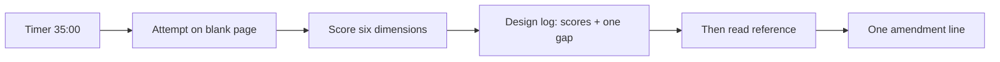
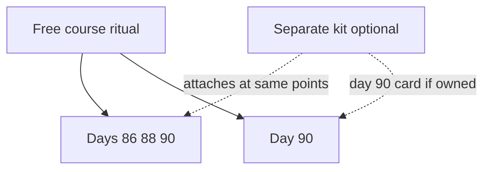

<!-- day-nav -->
[← Day 84 — Mock: delivery dispatch](84-mock-delivery-dispatch-with-a-late-failure.md) · [Day 86 — Mock: article serving →](86-mock-article-serving-read-heavy.md)

# Day 85 — Kit hookup and the design log

**Do now**

1. Set a timer.
2. Attempt the setup problem. Stop at the attempt line. Do not scroll.
3. Then read.

## Time box

35 minutes.

| Minutes | Do this |
|---|---|
| 0–12 | Attempt. Place your timer, rubric, and design-log template where you will actually use them for days 86–90. |
| 12–28 | Read. Wire the free course ritual. Note where a separate kit would attach — without buying anything. |
| 28–35 | Say the ritual out loud: timer source, what you may open, when you score, where the log lives. |

## Intent

Facing the last mocks without a shared ritual, leave able to run a timer, the senior rubric, and a design log, and see where the separate kit plugs in.

## Problem

> You have three closed-book interviews left this week: a read-heavy product, a write-heavy product, and a realtime product. You also have (or do not have) a separate interview kit sold outside this book.
>
> Set up the ritual you will use for days 86–90. Name what is free in this course, what the kit would add if you owned it, and what you will do on day 90 if you do not own it.

## Attempt before reading

12 minutes. Do not scroll. Do not open days 86–90 yet.

Write:

1. Where the **35-minute timer** lives (phone, kitchen timer, kit script — name one).
2. Which six rubric dimensions you will score (names only; you already used them on days 7, 28, 49, 63, 77, 84).
3. Where your **design log** will live for this week (private notes path or notebook). One sentence: you will not edit scores after you read a reference.
4. What you may open during a mock (problem card only) vs after the timer (day page under the barrier).
5. One line: if you do **not** own the kit on day 90, which fallback problem you will run.

---

**Stop. The ritual and the kit attachment are below. Do not change the attempt to match a purchase.**

---

## What this day is

Not a product design. Not a mock. This day installs the **same ritual** you already used on earlier mocks, written once so days 86–90 do not renegotiate it.

The interview kit is a **separate product**. It is not in this repository. It is not required for days 1–89. Day 90 is written so you can run it from the kit's current realtime card **or** from the fallback multiplayer-lobby problem in this book's problem bank. Do not block this week on a purchase.

## Requirements for the ritual

**In.** A visible timer. A blank page. One problem card from [`prompts/`](../prompts/README.md). The six-dimension rubric on the day page (above the barrier). A private design-log entry copied from [`design-log/TEMPLATE.md`](../design-log/TEMPLATE.md). Scores written **before** you scroll past the barrier. One gap sentence. Optional one-line amendment after the reference — scores stay frozen.

**Out.** Editing scores after reading. Opening Phase 4/5 lessons mid-mock. Treating the curriculum map as today's design. Waiting for the kit before day 86.

## The free course already has

| Piece | Where |
|---|---|
| Timer discipline | Every mock day's time box |
| Rubric anchors | Above the barrier on days 7, 28, 49, 63, 77, 84, and 86–90 |
| Problem cards | `prompts/` on this site |
| Design-log shape | `design-log/TEMPLATE.md` |
| Reference designs | Below the barrier, after you score |

That is enough to finish the 90 days.

## Where the kit attaches (if you own it)

The kit is sold separately. Typical pieces people buy for drills: a spoken timer script, printed requirements and estimation sheets, whiteboard stencils, a trade-off card, a follow-up question bank, grader notes, and extra problem cards. **This book does not ship those files.**

Attachment points you already practiced:

1. **Timer script** → same 0:00–35:00 bands the mock pages already print.
2. **Stencil / blank diagram** → same six redraw types from week 1 (context, whiteboard, read path, write path, data model, failure overlay).
3. **Trade-off card** → one named give-up per deep dive, already required for a 3+.
4. **Follow-up bank** → use only **after** you stop designing, as interviewer practice — never as a hint sheet mid-attempt.
5. **Extra problem cards** → day 90 prefers the kit's **current** realtime card when you have it; otherwise use this book's lobby fallback.
6. **Grader notes** → compare only after your own six scores are written.

If you do not own the kit, skip this section. Your attempt above already named the fallback.

## How days 86–90 use the ritual

| Day | Type | You open during the timer | You open after scores |
|---|---|---|---|
| 86 | Mock, read-heavy | [article-serving](../prompts/article-serving.md) only | Day 86 reference |
| 87 | Debrief | **Your** day-86 log only | Day 87 debrief notes |
| 88 | Mock, write-heavy | [event-intake](../prompts/event-intake.md) only | Day 88 reference |
| 89 | Debrief | **Your** day-88 log (and day-86 gap if useful) | Day 89 debrief notes |
| 90 | Mock, realtime | Kit realtime card **or** [multiplayer-lobby](../prompts/multiplayer-lobby.md) | Day 90 reference (lobby) |

Debrief days are not second designs of the product. They are **scoring and one rewrite** of the weakest section into the log.

## Diagrams

Caption: "Scores freeze before the reference. The amendment does not rewrite history."

Caption: "The kit plugs into the ritual. It does not replace days 1–89."

## A filled log entry (example, not yours)

This shows the shape on an earlier problem, so it spoils nothing this week. Day 77's email inbox. Read it for **evidence quality**, not for the design.

| Dimension | Score | Evidence from my page |
|---|---|---|
| Requirements | 3 | "Non-goals: spam ML, search ranking, attachments over 25 MB" |
| Estimates | 2 | "Lots of mail per day" — no per-user rate, no storage per year |
| API and data | 3 | "`messages(user_id, thread_id, msg_id)`, list by `(user_id, received_at)`" |
| Design | 3 | "Write path to per-user mailbox shard; read path paginates the index" |
| Deep dive | 2 | "Use Elasticsearch for search" — a product name, no cost named |
| Failure and ops | 2 | "Replicas" — nothing a user sees |

**One gap:** "Estimates had no numerator; next mock I write per-user rate × users before any box."

Notice what makes it honest. Every score points to words that are actually on the page. The 2s are not softened. There is one gap, not three. Because the gap is a rule, the next mock can check it.

## Evidence calibration

| Claimed | Evidence that supports it | Evidence that does not |
|---|---|---|
| Estimates 3 | "2k/s peak, 50 KB each ⇒ 100 MB/s uncached" | "High traffic" |
| Design 3 | "Publish bumps revision, then purge" | "CDN" alone |
| Deep dive 4 | A number or a concrete fault, plus what it does not solve | "We would tune it" |
| Failure 3 | "Sink down ⇒ producers get 503 and retry; page on append errors" | "It's replicated" |

If you cannot point to the phrase, write the lower score. A debrief day can raise a score only with evidence that was already on the page.

## Mock-day hygiene that quietly ruins the measurement

- Reading the next day's problem card the night before. The card is short, but your brain designs overnight.
- Rehearsing the reference you read for an earlier mock and calling it today's design.
- Pausing the timer for "just one thought." Interviews do not pause.
- Filling the log from memory a day later. Fill it inside the 10 minutes, or the scores drift upward.

## What you refuse

- Buying the kit as a gate to start day 86.
- Using follow-up banks or grader notes **during** the 35 minutes.
- A vanity average of the six scores instead of six numbers and one gap.
- Replacing the design log with a screenshot of the reference.

## Failure the ritual prevents

Without a frozen log, the reference becomes the attempt. You "score" a design you just read. That measures nothing. The miss you should fear is **contamination**, not a low number. A honest 2 with a clear gap beats a fake 4.

## Say this in the room (to yourself before day 86)

I run 35 minutes on a blank page with only the problem card open. I score requirements, estimates, API and data, design, deep dive, and failure from phrases on my page. I write one gap. Then I read. If I own a separate kit, it supplies script, stencils, and maybe day 90's card — it is not required for tomorrow's read-heavy mock. If I do not own it on day 90, I run the multiplayer-lobby fallback in this book's problem bank.

## Staff depth

Staff interviews reward **process you can repeat under stress**. This day is that process, named once. Product inventiveness still lives on 86, 88, and 90. Do not turn this page into a shopping list.

**What staff sounds like.** Timer. Card. Six scores. One gap. Amendment after. Kit optional.

## After you read this

Confirm your notes path and timer. Do not open day 86's reference. Tomorrow is closed book.

## Design log

Optional today: one line that your ritual is set (timer source + notes path). No product scores.

---

<!-- day-nav -->
[← Day 84 — Mock: delivery dispatch](84-mock-delivery-dispatch-with-a-late-failure.md) · [Day 86 — Mock: article serving →](86-mock-article-serving-read-heavy.md)
