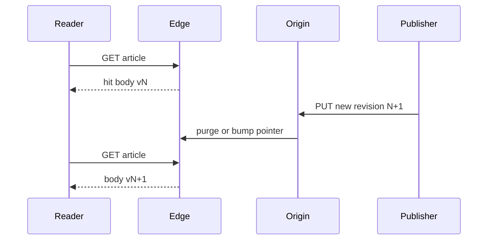
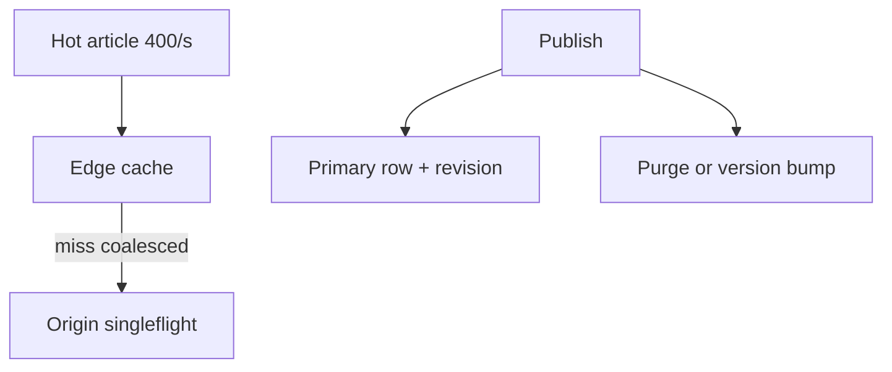

<!-- day-nav -->
[← Day 85 — Kit hookup and the design log](85-kit-hookup-and-the-design-log.md) · [Day 87 — Debrief: read-heavy mock →](87-debrief-read-heavy-mock.md)

# Day 86 — Mock: article serving (read-heavy)

**Do now**

1. Set a timer.
2. Attempt the problem. Stop at the attempt barrier.
3. Then read.

## Time box

35 minutes for the attempt, then 10 minutes to score and log. The 10 minutes are not part of the interview clock. Do not use them to keep designing.

## Intent

Facing a read-heavy problem that is not the kit-setup lesson, leave able to design article serving with hot pages and invalidation on publish, inside the time box.

## How to run

- Blank paper. No notes, no day 85 as a shopping list, no search, no chat.
- The only card you may have open is the [article serving problem](../prompts/article-serving.md) in the problem bank (`prompts/`). It does not help you.
- Do not scroll past the attempt barrier. The rubric is above the barrier so you can score. The design is below it.
- This is not a CDN lecture without a publish path, not day 15 as a checklist, and not a news-feed fan-out (day 51). If you only draw caches with no publish invalidation, stop and design publish → reader.
- Timer visible. At zero you stop, even mid-arrow.
- Score, then write the log from **your** page, then scroll.

Score what the product does. A complete page says how a reader gets an article body, what happens when one article is hot, how a publish updates what readers see, and what a reader sees when the origin or the cache layer lies. If invalidation is missing, log the gap. Do not scroll to find it.

If you already scrolled, close the page. Run the mock tomorrow from memory, or it measures nothing.

## Timer

| Clock | You are doing | You are not doing |
|---|---|---|
| 0:00–5:00 | Read article, publish/update, hot article. Non-goals. | Kit setup, feed ranking |
| 5:00–10:00 | Readers/day, publish rate, p99 read latency, working set. Peak. | Pastebin create QPS from muscle memory |
| 10:00–16:00 | API and keys: article id, revision, cache key. | Schema migration as the product |
| 16:00–28:00 | Read path vs publish path. Hot key. Invalidation or TTL bound. | Image upload thumbnail pipeline |
| 28:00–33:00 | Origin down or stale after publish — user-visible. | Ignoring staleness to polish boxes |
| 33:00–35:00 | What you did not build, and the 10× break. | A second product |

## Problem

> Design an article serving system.
>
> Readers open a public article by id or slug. Authors publish and update articles. Some articles are extremely hot. A reader who opens an article shortly after a publish should not keep seeing the previous body forever. Stay inside the time box.

That is the entire problem. Thirty-five minutes. Blank page. No notes.

## Rubric

Same six dimensions as day 7. Score 1–4 from your page only. A senior-shaped interview is mostly 3s. A staff-shaped interview is a 4 on the deep dive and a 4 on failure, not more boxes.

### Requirements

| Score | Anchor |
|---|---|
| 1 | Components first. No non-goals. |
| 2 | Behaviors listed. Constraints are adjectives. |
| 3 | Behavior, constraints, and non-goals locked before the design. Questions would change the cache key or publish path. |
| 4 | As a 3, and each non-goal is a product you refused, with a reason. |

### Estimates

| Score | Anchor |
|---|---|
| 1 | No numbers, or one QPS with no numerator. |
| 2 | Numbers exist. Units or assumptions are missing. |
| 3 | Read QPS, publish rate, article size, hot-article share, latency budget. Average and peak. Assumptions spoken. |
| 4 | As a 3, plus the assumption you trust least, and a 10× move tied to a named limit. |

### API and data

| Score | Anchor |
|---|---|
| 1 | No API. The CDN brand is the model. |
| 2 | Endpoints exist. Revision or cache key is vague. |
| 3 | GET article, publish/update with revision. Real keys. Stale window named. |
| 4 | As a 3, plus idempotent publish, and a distinction you refused to blur (draft vs live, or slug vs id). |

### Design

| Score | Anchor |
|---|---|
| 1 | A technology tour, or boxes that ignore the numbers. |
| 2 | Plausible boxes where every read hits origin, or publish never touches the cache. |
| 3 | Smallest design that meets the numbers. Edge/cache for reads, explicit invalidate or versioned URL on publish, hot-key plan. |
| 4 | As a 3, and you can say what the reader sees in the stale window you accepted. |

### Deep dive

| Score | Anchor |
|---|---|
| 1 | You cannot go past the boxes. |
| 2 | Under a push, the answer is a product name. |
| 3 | One dive, with a choice and a cost. |
| 4 | The dive uses arithmetic or a concrete fault. You can name what it did not solve. |

### Failure and ops

| Score | Anchor |
|---|---|
| 1 | "We'll have replicas," and no user-visible behavior. |
| 2 | A dependency is named. Impact is fuzzy. |
| 3 | Origin or invalidation path down. What readers see. What authors see. What you page on. |
| 4 | As a 3, plus the stale or unavailable window you still have after the mitigation. |

Do not average these into one vanity number. The log wants the six scores and **one** gap.

## Attempt first

Do the 35 minutes now.

When the timer stops:

1. Score the six dimensions from the anchors above. Evidence is a phrase on your paper.
2. Copy [design-log/TEMPLATE.md](../design-log/TEMPLATE.md) somewhere private. Fill it from your attempt. Scores are final once written.
3. Only then cross the barrier.

---

# Attempt barrier

You are about to read a reference design for article serving.

If your timer has not hit zero, go back up. If your design log is not filled, go back up. Below is a reference, not day 15 as a checklist and not a news feed. Use it for one amendment line. Do not edit the scores.

---

## Reference design

One legal design, at interview depth. Yours can differ and still be a 3. It is not a 3 if every read hits the primary for a public article, if publish never changes what a cache serves, if a hot article pins one origin row with no plan, or if the stale window after publish is unbounded and unnamed.

### What this is not

Not day 85 kit shopping. Not day 51 news feed fan-out. Not day 58 video. Not day 15 CDN as the only sentence. Not search (day 57). Article serving is **publish a body → many readers GET it**, with hot keys and a defined freshness after publish.

### Requirements

**In.** Public `GET` by `article_id` or slug returns title, body, metadata. Author `PUT`/`POST` publishes a new **revision**. Hot articles (front page, breaking) must not melt one origin. After publish, readers should see the new body within a **stated stale window** (planning: **≤ 30 s** for ordinary; **≤ 5 s** for breaking if you offer that class).

**Assumptions.** **10M** reads/day (~115/s average, **~2k/s** peak site-wide). One hot article can be **20%** of peak (**~400/s**). Average body **50 KB** HTML; metadata small. Publish rate **1/s** average, **20/s** peak across the catalog. p99 read from edge **≤ 200 ms** when cached. Origin miss budget **≤ 50 ms** store read.

**Out.** Personalized feed ranking, comments deep dive, full CMS workflow, A/B experimentation platform, image/video transcode (assume URLs), paywall identity thesis.

**Codes.** Publish returns the new `revision`. GET may include `ETag`/`revision`. Idempotent publish keyed by `(article_id, client_publish_id)`. Drafts are non-goals unless asked — refuse or park them.

### Estimates

Peak egress if uncached: 2k/s × 50 KB ≈ **100 MB/s** origin — ugly. With **95%+** edge hit, origin sees ~100/s. Hot article at 400/s uncached is **20 MB/s** alone on one key — needs edge or replicated cache, not one SQL primary.

10× peak reads (20k/s) breaks origin-on-miss without a wider edge; 10× publish may break a naive "purge all POPs synchronously on the request path."

### API and data

- `GET /v1/articles/{id}` → body + `revision`
- `PUT /v1/articles/{id}` (auth) → new `revision` (idempotent with `Idempotency-Key`)
- Optional `GET /v1/articles/by-slug/{slug}` → same document
- Store: `articles(article_id, slug, revision, body_ref_or_inline, updated_at)` — large bodies may sit in object storage with metadata in DB (day 14 shape) if bodies grow; for 50 KB, inline metadata+body in primary is fine at this scale if cached hard.
- Cache key: `article:{id}:v{revision}` **or** `article:{id}` with purge on publish. Prefer **versioned keys** for immutable entries plus a tiny pointer `article:{id}→revision`, or purge-by-tag on `article_id`.

### Design

**Read path.** Client → CDN/edge → (miss) origin API → cache-aside (Redis/regional) → primary. Public GETs are cacheable. Do not personalize this GET.

**Publish path.** Author write hits primary (single-writer per article row or compare-and-swap on `revision`). On success: (1) write new body+revision, (2) **invalidate or bump pointer** so edge does not serve forever. Options you can defend:

- **Purge/invalidate** by `article_id` across edge (fast reader freshness; purge fan-out cost).
- **Versioned URL/key** (`?v=` or key suffix): old entry expires by TTL; pointer update is small. Readers with open tabs may keep old HTML until refresh — say the window.

**Hot article.** Edge caches the object near readers. Stampede on miss: singleflight / request coalescing at origin (day 11 idea). Soft TTL + background revalidate beats thundering herd on expiry.

**TTL alone is not invalidation.** If you only set `TTL=5m` with no publish purge, you accepted up to five minutes of wrong body — say so, or add purge.

### Failure the user sees

| Person | Origin primary down | Invalidation/purge bus down |
|---|---|---|
| Reader (cached article) | Still served from edge until TTL | May see old body past the promised window |
| Reader (miss, cold) | 5xx / retry | Unaffected if origin up |
| Author | Publish 5xx | Publish may 200 while readers stay stale — **broken promise**; prefer fail publish or mark `freshness_degraded` and page |
| Operator | Page origin errors + read miss rate | Page purge failure rate and stale-age histogram |

### Diagrams

Caption: "Publish must touch what the edge serves. TTL alone is a named stale window."

Caption: "Hot path is edge. Correctness path is revision + invalidate."

### Trade-offs

**Purge-on-publish vs long TTL.** Freshness vs purge fan-out and complexity.

**Versioned immutable objects vs mutable key.** Simpler CDN math vs pointer management.

**Inline body vs object storage.** One read vs two; at 50 KB inline is fine; at multi-MB move bytes out.

### Say this in the room

Article serving is a read-heavy path: peak thousands of GETs per second, one article can be hundreds per second alone, so public bodies live at the edge with coalesced origin misses. Publish writes a new revision on the primary and either purges by article id or bumps a versioned cache key so the stale window is bounded — I will not pretend a five-minute TTL is invalidation. If purge is down I will not silently ack a breaking update as globally fresh; I page on stale-age and purge failures. Hot keys get soft TTL and singleflight, not a hotter SQL primary.

### Staff depth

Staff credit is the **publish → reader freshness** sentence with a number, and a hot-key plan that is not "more RAM." Unbounded stale after a successful publish is the honesty fail.

**What staff sounds like.** Revision. Edge hit ratio. Stale bound. Singleflight. Page on purge fail.

### After you read this

One amendment line: the concrete miss (no invalidation, no hot-key plan, every read to origin, feed fan-out instead of article GET). Leave the scores alone.

Tomorrow is the debrief — bring **your** log, not this reference.

## Design log

Six scores and one gap — especially whether publish changed what readers see on your page.

---

<!-- day-nav -->
[← Day 85 — Kit hookup and the design log](85-kit-hookup-and-the-design-log.md) · [Day 87 — Debrief: read-heavy mock →](87-debrief-read-heavy-mock.md)
