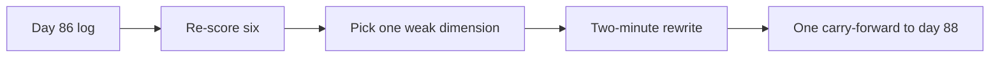

<!-- day-nav -->
[← Day 86 — Mock: article serving](86-mock-article-serving-read-heavy.md) · [Day 88 — Mock: event intake →](88-mock-event-intake-write-heavy.md)

# Day 87 — Debrief: read-heavy mock

**Do now**

1. Set a timer.
2. Open **your** day-86 design log only. Stop at the attempt line.
3. Then read.

## Time box

35 minutes.

| Minutes | Do this |
|---|---|
| 0–15 | Attempt. Re-score day 86 from your page evidence. Rewrite only the weakest section into the log. |
| 15–28 | Read. Compare your gap to common read-heavy misses. One amendment line max. |
| 28–35 | Say the one staff-level fix you will carry into day 88 — not a list. |

## Intent

Facing the day-86 writeup, leave able to score it on the senior rubric and rewrite only the weakest section into the design log.

## Problem

> Take your day-86 article-serving attempt and log only.
>
> Re-score the six dimensions using the anchors on day 86 (or the copy below). Do not open the day-86 reference while you re-score. Rewrite **one** section — the weakest — as you would say it in the room in under two minutes. Leave the other sections alone.

## Attempt before reading

15 minutes. **Allowed:** your day-86 log and your handwritten page if you still have it. **Forbidden:** day 86 below the barrier, search, chat, day 15/51 lessons as a patch kit.

Write:

1. Six scores again. If a score changes, one phrase of evidence must justify it — otherwise keep the original.
2. The single weakest dimension (name it).
3. A rewrite of that section only: requirements snippet, or estimate with units, or API keys, or read/publish path, or failure overlay — matching whatever was weakest.
4. One sentence: what you will watch for on the write-heavy mock (day 88), transferred from this gap if possible (example: "name the ack vs durable sink," parallel to "name the stale bound").

---

**Stop. Debrief notes are below. Do not paste the day-86 reference into your log.**

---

## How a debrief earns credit

A debrief is not a second mock and not a shame spiral. Staff signal is **selective repair**: one hole closed in language you can reuse tomorrow.

Refuse:

- Re-scoring after peeking at the reference.
- Rewriting all six sections.
- Replacing your design with the reference voice.

## Rubric reminder (same six)

Requirements · Estimates · API and data · Design · Deep dive · Failure and ops — anchors live on [day 86](86-mock-article-serving-read-heavy.md) above its barrier. Use those anchors. Do not invent a seventh dimension.

## Common day-86 gaps (check yours, do not collect them all)

| Gap | What a strong rewrite sounds like |
|---|---|
| No stale bound after publish | "Publish bumps revision and purges `article_id`; readers may see old body ≤ N seconds." |
| Hot article = bigger SQL | "Edge caches the body; origin miss is singleflight; primary is not the hot path." |
| TTL called invalidation | "TTL alone accepts up to TTL of wrong body; purge or versioned key is the publish path." |
| No publish API | "PUT returns revision; idempotency key on publish; GET returns ETag/revision." |
| Failure without a reader sentence | "If purge is down, author 200 with readers stale is a broken promise — page stale-age." |

If your gap is not in the table, keep yours. The table is a mirror, not a checklist to cram.

## Diagrams

Caption: "Debrief repairs one joint. It does not redecorate the whole skeleton."

## Say this in the room

My day-86 gap was [dimension]. The rewrite is [two minutes]. For day 88 I will lock [parallel discipline] before I draw boxes.

## Staff depth

Interviewers notice whether you can **grade yourself**. Inflated scores without evidence are worse than a 2 with a crisp gap. Day 89 will ask you to compare write-heavy vs read-heavy — keep today's scores honest.

**What staff sounds like.** Evidence phrase. One rewrite. Carry-forward.

## What a weak debrief looks like

- Replacing your publish path with the reference wording and calling it a 4.
- Listing five gaps and "working on all of them."
- Skipping re-score because "I remember I did fine."
- Opening day 15 mid-debrief to borrow CDN vocabulary you never drew.

## Failure the user (you) sees if you skip this day

You walk into day 88 with an unrepaired read-path habit. Write-heavy interviews still need a named bound after a successful write — durable ack instead of edge purge, but the same honesty. Skipping the rewrite costs the comparison day 89 asks for.

## Talk tracks (pick one that matches your gap)

1. "My estimates had read QPS but no hot-article share; 20% of peak on one id is the stampede I should have sized."
2. "I drew CDN and never said what publish does to the object; that is a 2 on design until the purge or version bump is spoken."
3. "I said TTL equals freshness; I will rewrite it as a stale window I accept, or add invalidation."

## Carry-forward bank (choose one for day 88)

- Name the success ack and what durable means.
- Name a numeric bound after a write (stale seconds or late minutes).
- Name the hot partition or hot key before listing brands.

## Worked rewrite example (not your scores)

Suppose your day-86 page had CDN boxes and "TTL 5 minutes" with no publish sentence. Weakest dimension: **Design** (2).

**Rewrite (under two minutes):** "Public GET is edge-cached by `article_id`. Publish writes revision N+1 on the primary, then purges that id (or bumps a versioned key). Readers may see the old body for at most thirty seconds if a POP is slow to purge — that is the stale window I accept. A hot article at a few hundred reads per second stays on the edge; origin misses coalesce so one primary row is not the hot path. TTL alone is not my invalidation story."

That paragraph is what goes in the log under the rewrite. Do not copy it if your gap was different.

## Re-score calibration: what evidence can move a day-86 score

A re-score changes only when you find a phrase you **already wrote** that you under-credited, or a claim the page does not support. Typical honest moves:

| Move | Legitimate if your page shows | Not legitimate |
|---|---|---|
| Estimates 2 → 3 | Peak reads, body size, and a hot share with units | You now remember what the numbers should have been |
| Design 3 → 2 | Publish never touches the cache on your page | — (downgrades need no new evidence, only honesty) |
| Failure 2 → 3 | A line saying what readers see when origin or purge is down | "I was going to say stale-if-error" |
| Deep dive 3 → 4 | A number or a concrete fault, and what it did not fix | A longer explanation written today |

Downgrades are common on debrief day and are a good sign. They mean the anchors are working.

## Interviewer follow-ups for your weakest dimension

Pick the row that matches your weakest dimension. Set a 60-second timer and answer aloud as if the interviewer just asked. If you stall, that is the sentence to put in the rewrite.

| Weakest | Follow-up to answer aloud |
|---|---|
| Requirements | "What did you decide not to build, and why does that change your design?" |
| Estimates | "How many reads hit your origin at peak, and what assumption moves that most?" |
| API and data | "What exactly is your cache key, and what changes it?" |
| Design | "I just published. Walk me through what the next reader sees, and when." |
| Deep dive | "Pick the riskiest part. What breaks first at 10×?" |
| Failure and ops | "Your invalidation path is down. What does the author see? The reader? Who gets paged?" |

## What you refuse on a debrief day

- Opening the day-86 reference to "check" before re-scoring.
- Turning the carry-forward into a five-item study plan.
- Skipping the design log because the rewrite lived only in your head.

## After you read this

Do not reopen day 86's reference to "finish" the log. Day 88 is closed book tomorrow.

## Design log

Append to the day-86 entry (or a short day-87 addendum): re-scores if changed, the rewrite, the carry-forward sentence.

---

<!-- day-nav -->
[← Day 86 — Mock: article serving](86-mock-article-serving-read-heavy.md) · [Day 88 — Mock: event intake →](88-mock-event-intake-write-heavy.md)
