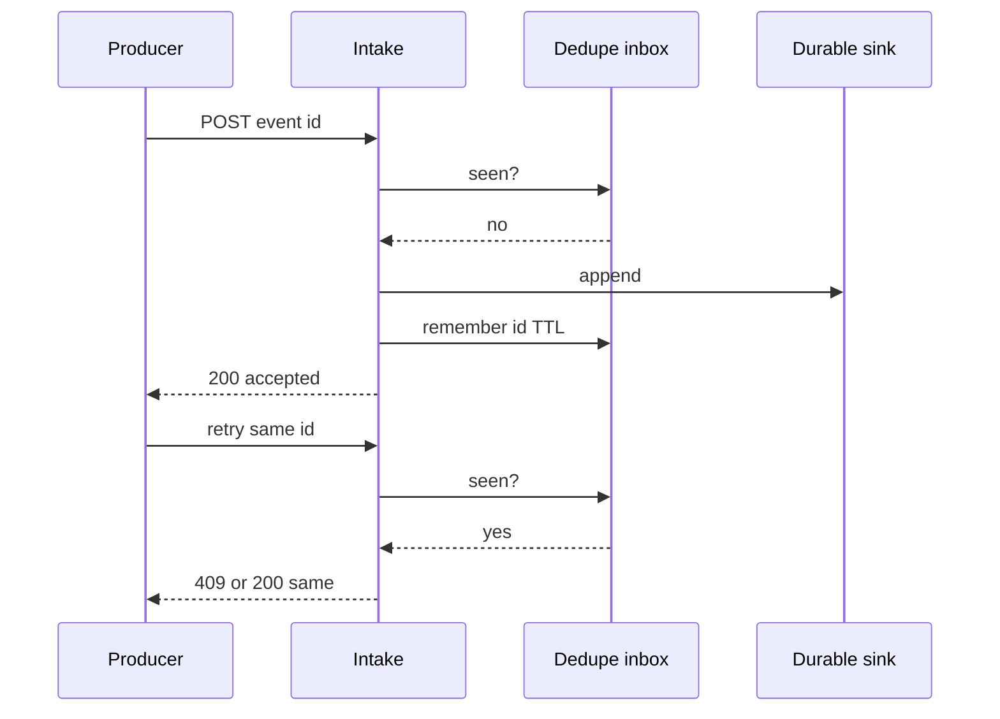
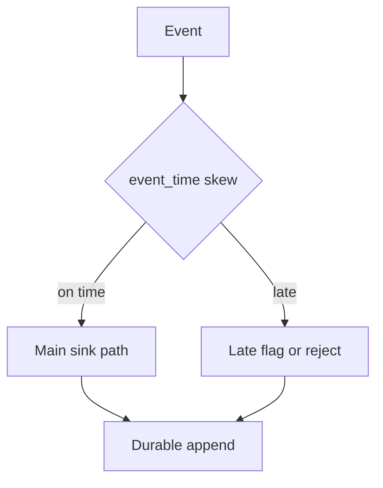

<!-- day-nav -->
[← Day 87 — Debrief: read-heavy mock](87-debrief-read-heavy-mock.md) · [Day 89 — Debrief: write-heavy mock →](89-debrief-write-heavy-mock.md)

# Day 88 — Mock: event intake (write-heavy)

**Do now**

1. Set a timer.
2. Attempt the problem. Stop at the attempt barrier.
3. Then read.

## Time box

35 minutes for the attempt, then 10 minutes to score and log. The 10 minutes are not part of the interview clock. Do not use them to keep designing.

## Intent

Facing a write-heavy problem, leave able to design event intake with dedupe, late events, and a durable sink, and leave a complete design-log entry.

## How to run

- Blank paper. No notes, no day 62/64 metrics lessons as a template, no search, no chat.
- The only card you may have open is the [event intake problem](../prompts/event-intake.md) in the problem bank (`prompts/`). It does not help you.
- Do not scroll past the attempt barrier. The rubric is above the barrier so you can score. The design is below it.
- This is not a metrics query dashboard day, not a payments ledger, and not "Kafka" as the whole answer. If you have no dedupe key and no late-event policy, stop and define them.
- Timer visible. At zero you stop, even mid-arrow.
- Score, then write the log from **your** page, then scroll.

Score what the product does. A complete page says how producers send events, how duplicates are handled, what "late" means, where durable truth lands, and what operators see when the sink or the queue stalls. If at-least-once is assumed with no idempotency story, log the gap.

If you already scrolled, close the page. Run the mock tomorrow from memory, or it measures nothing.

## Timer

| Clock | You are doing | You are not doing |
|---|---|---|
| 0:00–5:00 | Ingest event, dedupe, late, query/sink. Non-goals. | Metrics graph UI, article CDN |
| 5:00–10:00 | Events/s, payload size, late skew, durability RPO. Peak. | Pastebin create QPS |
| 10:00–16:00 | API and keys: event_id, producer_id, event_time vs ingest_time. | Exactly-once as a brand name with no mechanism |
| 16:00–28:00 | Write path: receive → validate → durable sink. Dedupe store. | Read-heavy edge cache as the design |
| 28:00–33:00 | Queue full or sink down — producer and consumer visible behavior. | Ignoring backlog |
| 33:00–35:00 | What you did not build, and the 10× break. | A second product |

## Problem

> Design an event intake system.
>
> Many producers send events. The system must accept them at high write rates, avoid treating retries as new facts, deal with events that arrive late, and land them in a durable sink downstream consumers can trust. Stay inside the time box.

That is the entire problem. Thirty-five minutes. Blank page. No notes.

## Rubric

Same six dimensions as day 7. Score 1–4 from your page only.

### Requirements

| Score | Anchor |
|---|---|
| 1 | Components first. No non-goals. |
| 2 | Behaviors listed. Constraints are adjectives. |
| 3 | Behavior, constraints, and non-goals locked. Questions would change dedupe keys or late policy. |
| 4 | As a 3, and each non-goal is a product you refused, with a reason. |

### Estimates

| Score | Anchor |
|---|---|
| 1 | No numbers, or one QPS with no numerator. |
| 2 | Numbers exist. Units or assumptions are missing. |
| 3 | Ingest QPS, payload bytes, late fraction, sink write budget. Average and peak. Assumptions spoken. |
| 4 | As a 3, plus the assumption you trust least, and a 10× move tied to a named limit. |

### API and data

| Score | Anchor |
|---|---|
| 1 | No API. The queue brand is the model. |
| 2 | Endpoints exist. Dedupe key or event_time is vague. |
| 3 | Ingest API, idempotency/dedupe key, event_time vs ingest_time, sink schema. Late threshold named. |
| 4 | As a 3, plus a clear reject vs accept-but-mark-late policy. |

### Design

| Score | Anchor |
|---|---|
| 1 | A technology tour, or boxes that ignore the numbers. |
| 2 | Plausible boxes with no dedupe, or "exactly once" with no mechanism. |
| 3 | Smallest design that meets the numbers. At-least-once ingest, idempotent sink write, late policy, durable log/table. |
| 4 | As a 3, and you can say what consumers see when an event is late or duplicated on the wire. |

### Deep dive

| Score | Anchor |
|---|---|
| 1 | You cannot go past the boxes. |
| 2 | Under a push, the answer is a product name. |
| 3 | One dive, with a choice and a cost. |
| 4 | The dive uses arithmetic or a concrete fault. You can name what it did not solve. |

### Failure and ops

| Score | Anchor |
|---|---|
| 1 | "We'll have replicas," and no user-visible behavior. |
| 2 | A dependency is named. Impact is fuzzy. |
| 3 | Sink or queue down. Producer ack behavior. Backlog. What you page on. |
| 4 | As a 3, plus the crash window where a duplicate can still appear after your mitigation. |

Do not average these into one vanity number. The log wants the six scores and **one** gap.

## Attempt first

Do the 35 minutes now.

When the timer stops:

1. Score the six dimensions from the anchors above. Evidence is a phrase on your paper.
2. Copy [design-log/TEMPLATE.md](../design-log/TEMPLATE.md) somewhere private. Fill it from your attempt. Scores are final once written.
3. Only then cross the barrier.

---

# Attempt barrier

You are about to read a reference design for event intake.

If your timer has not hit zero, go back up. If your design log is not filled, go back up. Below is a reference, not a metrics dashboard and not a payments ledger. Use it for one amendment line. Do not edit the scores.

---

## Reference design

One legal design, at interview depth. Yours can differ and still be a 3. It is not a 3 if retries create double facts with no dedupe, if "exactly once" is claimed with no mechanism, if late events are undefined, or if the producer gets a 200 before anything durable exists (unless you explicitly defined a weaker ack — and named the loss).

### What this is not

Not day 62 metrics ingestion as a copy-paste. Not day 64 alerts UI. Not day 65 payments money movement. Not day 86 article reads. Event intake is **producers → durable ordered-enough log/sink** with dedupe and late policy.

### Requirements

**In.** `POST` ingest of events from many producers. At-least-once delivery on the wire. **Dedupe** so the same producer retry does not double-apply. **Late** events: `event_time` skew vs `ingest_time` beyond a bound (planning: **≥ 15 minutes** late) get a defined policy (reject, or accept into a late path). Durable sink consumers can read (log + consumer offsets, or append-only table). Backpressure when sink or queue cannot keep up.

**Assumptions.** **50k events/s** average, **200k/s** peak. Payload **512 bytes** average. Producers: **10k** online. Dedupe key: `(producer_id, event_id)` with event_id unique per producer. Dedupe retention **24 hours** (inbox style). RPO for acked events: **0** (ack only after durable). Late threshold **15 minutes**; late fraction **0.1%** under normal NTP; spikes when a mobile producer comes online.

**Out.** Full complex event processing / CEP product, exactly-once *across arbitrary side effects* without an idempotent sink, ML feature store, OLAP cube design, per-tenant billing UI.

**Codes.** Duplicate ingest: same sink record / same applied side effect. Ack before durable: forbidden in this design. Late: marked `late=true` and landed in sink **or** `400 late_rejected` — pick one and keep it.

### Estimates

Peak ingest bytes: 200k/s × 512 B ≈ **100 MB/s**. Partition the log. Dedupe store: 50k/s × 24 h ≈ **4.3B** keys if naive — too many. Bound with TTL and shard by `producer_id` hash; expect working set of recent keys much smaller if producers are well-behaved — still size the TTL store (e.g. Redis/memory + spill) and say eviction means a rare double-apply window.

10× peak (2M/s) breaks a single partition and a single dedupe box — shard ingest and dedupe.

**Staff arithmetic: partitions, storage, dedupe memory.** Peak 100 MB/s. If one log partition comfortably takes ~10 MB/s of replicated writes, you need **≥ 10**. Plan **32–48** for headroom and rebalancing, and say that the per-partition number is an assumption you would measure. Storage: 50k/s × 512 B × 86,400 s ≈ **2.2 TB/day** raw, ×3 replicas ≈ **6.6 TB/day**, so 7-day retention is about **46 TB** — retention is a cost lever you name. **Dedupe in two tiers:** retries cluster within minutes, so a **10-minute hot window** at peak is 200k/s × 600 s = **120M keys**, ~50 B each ≈ **6 GB** — in memory, sharded by producer. The full 24 h at average (~4.3B keys ≈ **216 GB**) does not belong in memory; a unique key at the sink catches the rare slow retry. **Batching:** producers sending 100 events per request turn 200k events/s into **~2k requests/s**, which changes the intake fleet size by two orders of magnitude.

### API and data

- `POST /v1/events` headers: `Idempotency-Key` or body `(producer_id, event_id)`, `event_time`, payload
- Response: `202`/`200` with `accepted` only after durable append (or `409` duplicate, `400` validation, `429` backpressure, `503` sink unavailable)
- Sink: append-only log partitions by `hash(producer_id)` or `hash(tenant)`; consumer checkpoint separate
- Dedupe inbox: key `(producer_id, event_id) → sink_offset_or_hash`, TTL 24h

### Design

**Write path.** Validate → check dedupe inbox → append to durable log → write inbox → ack. Order of inbox vs append: if you ack after append but crash before inbox, retry may double-append — prefer **transactional outbox pattern with the log as source of truth** and idempotent append using the event key as the log's idempotency (many systems: produce with key, broker/log dedupes, or sink consumer dedupes). Interview-clean story: **sink unique on `(producer_id, event_id)`**; retries upsert.

**Late path.** Compare `event_time` to wall clock at ingest (say the clock dependency). If skew > 15 minutes: either reject or accept with `late` flag for downstream watermark logic. Do not drop silently.

**Consumers.** Read sink with offsets. At-least-once to consumers; they must be idempotent too — say it.

**Backpressure.** When log lag or sink write latency burns SLO, return **429/503** to producers; do not OOM buffer unbounded in the intake process.

### Failure the user sees

| Person | Durable sink/log down | Dedupe store down |
|---|---|---|
| Producer | 503; must retry; no false 200 | Fail closed: 503 (risk double) **or** accept with higher double risk — prefer **fail closed** and page |
| Downstream consumer | Lag freezes; read last durable | Unaffected if sink up |
| Operator | Page sink write errors + producer 5xx | Page dedupe errors; watch duplicate apply rate |

### Deep dive: the crash windows, in order

Name the order of operations, then walk every crash point. This is the 4 on Failure.

1. **Append, then crash before the dedupe inbox is written.** The producer never got an ack and retries. The inbox says "not seen," so a second append happens. Mitigation: the sink is unique on `(producer_id, event_id)`, so the second copy is absorbed downstream. Residual: the log briefly holds two copies, and consumers must tolerate that.
2. **Inbox written first, then crash before append.** The retry sees "seen" and returns success for an event that was **never stored**. That is silent loss, which is worse than a duplicate. Refuse this order out loud: never record "seen" before the durable append.
3. **Durable append and inbox both done, ack lost on the network.** The retry hits the inbox and gets the **original response replayed** (same offset, same status). Prefer an idempotent replay over a bare `409`, so producers do not need special-case logic.
4. **Inbox entry evicted (TTL or memory pressure), then a slow retry.** Only the sink's unique key stands between you and a double fact. Say the window: retries older than the hot tier rely on the sink.

### Clocks lie in both directions

Late is measured as ingest wall clock minus `event_time`, so you depend on the producer's clock. **Late past 15 minutes** follows your policy (flag or reject). **Future skew** (event_time more than ~5 minutes ahead of ingest) is a broken producer clock, not an early event. Flag it `clock_skew` and do not let it advance downstream watermarks, or one bad phone closes everyone's time window early.

### Batches fail partially

A batch of 100 where 3 events fail validation should not reject the 97. Return **per-event status** in the response. A retry of the whole batch is safe because every event carries its own key.

### Ordering you promise, and ordering you refuse

Order is per partition, so per producer if you key by `producer_id`. Global order across producers is refused: it needs a single partition, and one partition cannot take 100 MB/s at peak, let alone 10×. One noisy producer can hot-spot its partition. Use a per-producer rate limit, or salt that producer's key and give up its ordering. Say which.

### Wrong answers that cap the score

**"Kafka gives exactly once."** Broker transactions do not make an arbitrary downstream side effect happen once. Without a key and an idempotent sink, that is a slogan.

**Unbounded in-memory buffer at intake.** You turned backpressure into an out-of-memory crash, and lost everything in the buffer.

**Dedupe by payload hash.** Two distinct events with identical bodies (two identical clicks) collapse into one. The producer's `event_id` is the identity.

**Late events silently dropped.** The offline mobile producer's whole session vanishes. That is data loss with no metric.

**Metrics dashboard as the design.** Day 62 is a different product. The intake path is the hour.

### Diagrams

Caption: "Ack after durable. Retry hits dedupe, not a second fact."

Caption: "Late is a policy, not a shrug."

### Trade-offs

**Ack after durable vs fast 202 + async.** Loss window vs producer latency.

**Reject late vs accept marked late.** Watermark simplicity vs data loss for offline producers.

**Dedupe at intake vs at sink consumer.** Earlier save of sink volume vs longer duplicate window on the log.

**Name the refusal inside each alternative.** Ack after durable refuses silent loss and accepts producer latency. A fast 202 before durable refuses latency and accepts a loss window you must name. Rejecting late events refuses watermark complexity and accepts losing offline producers' data. Accepting with a late flag refuses loss and accepts a correction path downstream. A per-producer partition key refuses cross-producer ordering and accepts hot-producer risk.

### Say this in the room

Event intake is write-heavy: hundreds of thousands of events per second at peak, at-least-once on the wire, so every accepted event is keyed by `(producer_id, event_id)` and the durable sink upserts on that key before I ack. Late means event_time skew past fifteen minutes — I either reject or land with a late flag; I do not vanish the event. If the sink is down producers get 503 and retry; if dedupe is down I fail closed rather than silently double-apply. Consumers still need their own idempotency because delivery to them is at-least-once too.

### Staff depth

Staff credit is **ack semantics**, **dedupe retention**, and a **late policy with a number**. "Kafka" without those three is a brand tour.

**What staff sounds like.** Idempotency key. Ack after durable. Late threshold. Backpressure. Duplicate crash window.

### Talking points (when the interviewer pushes)

**"Make it exactly once."** "On the wire it is at-least-once. Effectively-once is the producer key plus a sink unique on that key, plus idempotent consumers. I'll show the crash window where a duplicate still sits in the log."

**"The sink is slow, not down."** "Log lag grows. Past the lag SLO intake returns 429 with Retry-After and jitter. Producers keep a bounded local buffer, and I name what a full producer buffer drops."

**"A producer's clock is a day behind."** "Every event looks late. Flag it, count by producer, and alert that producer's owner. Don't let it poison watermarks."

### More probes, with the answer

**"What pages?"** Durable append error rate, end-to-end lag against the SLO, the 429 rate by producer, the duplicate-absorbed count at the sink (a jump means the dedupe tier is failing). **"What do you refuse?"** Ack before durable, recording "seen" before append, global ordering, payload-hash dedupe. **"What is the sensitive assumption?"** The retry distribution. If retries arrive hours later, the hot dedupe tier misses and the sink key carries everything. **"Where does the time go?"** Lock the ack, key, and late policy by minute 20. Then the crash windows. The brand is not the design.

### Failure at grading altitude

| Fault | Wrong answer | Staff answer |
|---|---|---|
| Crash after append, before inbox | "Rare" | Retry absorbed by sink unique key; duplicate visible in the log only |
| Inbox written before append | Not noticed | Refused ordering: it turns a crash into silent loss |
| Sink down | Buffer in memory, 200 | 503, producers retry, page on append errors |
| Dedupe tier down | Accept everything silently | Fail closed, or accept and lean on the sink key while counting absorbed duplicates |

### After you read this

One amendment line: the concrete miss (ack before durable, no late policy, exactly-once slogan, metrics UI). Leave the scores alone.

Tomorrow is the write-heavy debrief — bring **your** log.

## Design log

Six scores and one gap — especially dedupe and late on your page.

---

<!-- day-nav -->
[← Day 87 — Debrief: read-heavy mock](87-debrief-read-heavy-mock.md) · [Day 89 — Debrief: write-heavy mock →](89-debrief-write-heavy-mock.md)
