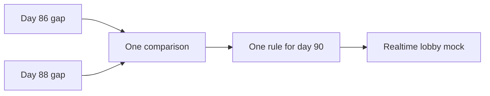

<!-- day-nav -->
[← Day 88 — Mock: event intake](88-mock-event-intake-write-heavy.md) · [Day 90 — Mock: realtime lobby →](90-mock-realtime-lobby-kit-run.md)

# Day 89 — Debrief: write-heavy mock

**Do now**

1. Set a timer.
2. Open **your** day-88 design log (and day-86 gap if useful). Stop at the attempt line.
3. Then read.

## Time box

35 minutes.

| Minutes | Do this |
|---|---|
| 0–15 | Attempt. Re-score day 88. Rewrite the weakest section. Compare one line to day 86. |
| 15–28 | Read. Lock the one staff-level gap to close before day 90. |
| 28–35 | Say that gap out loud as a rule you will follow in the realtime mock. |

## Intent

Facing the day-88 writeup, leave able to score it, compare it with day 86, and log the one staff-level gap to close before the final mock.

## Problem

> Take your day-88 event-intake attempt and log only.
>
> Re-score the six dimensions using the anchors on day 88. Do not open the day-88 reference while you re-score. Rewrite **one** weakest section. Then write **one** comparison sentence vs day 86 (read-heavy): what skill transferred, and what is still missing for a realtime interview.

## Attempt before reading

15 minutes. **Allowed:** your day-88 log, your day-86/87 gap line, handwritten pages. **Forbidden:** day 88 below the barrier, search, chat, day 62/64 as a patch kit.

Write:

1. Six scores for day 88 with evidence phrases.
2. Weakest dimension + two-minute rewrite.
3. Comparison to day 86: one sentence (example: "I named stale bounds on 86 but still acked before durable on 88").
4. **The** gap to close before day 90 (one sentence rule).

---

**Stop. Debrief notes are below. Do not paste the day-88 reference into your log.**

---

## Compare without collecting trophies

| Lens | Read-heavy (86) often fails on | Write-heavy (88) often fails on |
|---|---|---|
| Truth after a write | Publish did not change what readers see | Ack did not mean durable / deduped |
| Hot path | One key melts origin | One partition or one dedupe box melts |
| Honesty | TTL sold as invalidation | "Exactly once" sold without a key |
| Ops | Purge down, silent stale | Sink down, silent 200 |

Your comparison sentence should point at **your** logs, not this table.

## Common day-88 gaps

| Gap | Strong rewrite |
|---|---|
| Ack before durable | "200 only after append; crash before inbox means retry upserts on `(producer_id, event_id)`." |
| No late policy | "Skew > 15 minutes → late flag or 400; never silent drop." |
| Exactly-once slogan | "At-least-once on the wire; idempotent sink; consumers still idempotent." |
| Unbounded buffer | "429/503 when lag burns; producers retry; intake does not OOM." |
| Dedupe forever | "Inbox TTL 24h; after eviction a rare double-apply window — say it." |

## The one gap before day 90

Realtime lobbies punish the same honesty failures under **time pressure and presence**: duplicate joins, stale membership, ack of a move that never committed. Translate your gap into a rule such as:

- "No success response until the room state mutation is durable."
- "Every client retry carries an idempotency key."
- "Stale presence has a numeric TTL and a user-visible effect."

Pick **one** rule. Carve it on the log.

## Diagrams

Caption: "Two mocks feed one rule. Day 90 is not a third lecture."

## Failure this debrief prevents

Walking into day 90 with a vague feeling of "I should be more careful." Feelings do not survive minute 20. A single written rule does.

## Say this in the room

Day 86 taught me [X]. Day 88 showed I still miss [Y]. For the lobby mock I will [one rule] before I draw the websocket boxes.

## Staff depth

Staff candidates show **trajectory across interviews**, not one lucky diagram. Days 87 and 89 exist so the design log becomes that trajectory. Day 90 should read your rule, not a new personality.

**What staff sounds like.** Comparison sentence. One rule. No shopping list.

## What a weak debrief looks like

- Averaging day 86 and day 88 into one vanity score.
- Carrying three rules into day 90 (none will be remembered at minute 25).
- Re-opening the event-intake reference to inflate failure/ops after the fact.

## Failure if you skip the comparison

Realtime lobby looks "new" so you invent a third personality. Staff interviewers hear whether start/join success means a durable room mutation — the same family as ack-after-durable. Without the comparison sentence, day 90 often regresses to websocket tourism.

## Talk tracks

1. "On 86 I bounded reader stale time; on 88 I still returned 200 before append — the rule for 90 is no success until seat or start CAS lands."
2. "On 88 I named late skew; for lobby I will name presence TTL with a user-visible leave."
3. "I used a queue brand without a dedupe key; for lobby every join carries player_id idempotency."

## Optional self-check (two minutes)

Without scrolling to any reference: can you say your day-90 rule in one breath? If not, shorten it until you can.

## Worked rewrite example (not your scores)

Suppose your day-88 page said "Kafka, exactly once" and returned 200 at the intake process before naming a sink. Weakest dimension: **Design** or **Failure** (2).

**Rewrite:** "Producers POST with `(producer_id, event_id)`. Intake appends to a durable log partitioned by producer hash, upserts a dedupe inbox with a twenty-four-hour TTL, then acks. Retries hit the same key. Events with event_time skew past fifteen minutes are accepted with `late=true` (or rejected — I pick one). If the sink is down I return 503, never a silent 200. Exactly-once across arbitrary consumers is refused; consumers must be idempotent under at-least-once delivery."

## Day 90 rule examples (pick one that matches you)

- "No 200 on join or start until the seat or CAS mutation is durable."
- "Every retry carries the same player_id; reconnect never clones a seat."
- "Presence without a heartbeat for thirty seconds is a leave the room can see."

## Re-score calibration: what evidence can move a day-88 score

| Move | Legitimate if your page shows | Not legitimate |
|---|---|---|
| API and data 2 → 3 | A dedupe key with both parts named, plus `event_time` | "I meant producer_id plus event_id" |
| Design 3 → 2 | Success returned before anything durable, with no named loss | — |
| Failure 3 → 4 | One crash point walked with its residual duplicate or loss | A crash walk you can only do now |
| Estimates 2 → 3 | Peak events/s × bytes with units, and a dedupe retention | "Big data volume" |

## Questions that transfer to any realtime problem

These are the questions behind days 86 and 88, without the answers for tomorrow. Before you draw boxes on day 90, you should be able to answer each one for that problem.

1. **What does success mean?** Which state change must have landed before the user sees "done"?
2. **What is the stale bound?** When the truth changes, how long can a user see the old truth? Give a number.
3. **What does a retry do?** Which key makes the second attempt land on the same result?
4. **Who owns the truth, and what happens when the owner dies?** What does the user see in that window?

Your one rule for day 90 is usually the answer to whichever question your logs show you skip.

## Interviewer follow-ups for your weakest dimension

60 seconds each, aloud, for your weakest row only.

| Weakest | Follow-up to answer aloud |
|---|---|
| API and data | "A producer retries after a timeout. Show me exactly how you avoid a second fact." |
| Design | "When do you send the 200, and what exists on disk at that moment?" |
| Deep dive | "You crash between the append and the dedupe write. What happens on the retry?" |
| Failure and ops | "The sink is slow, not down. What do producers see in the first minute? The tenth?" |

## After you read this

Do not reopen day 88's reference to polish scores. Day 90 is closed book (kit card or lobby fallback).

## Design log

Append: re-scores, rewrite, comparison vs day 86, the day-90 rule.

---

<!-- day-nav -->
[← Day 88 — Mock: event intake](88-mock-event-intake-write-heavy.md) · [Day 90 — Mock: realtime lobby →](90-mock-realtime-lobby-kit-run.md)
