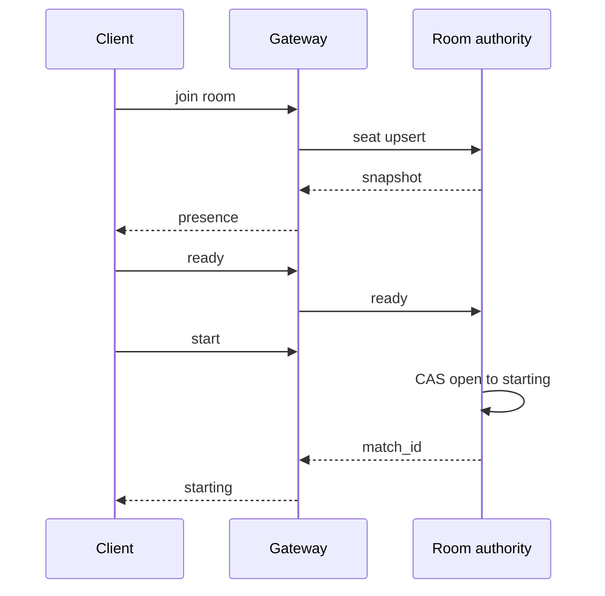
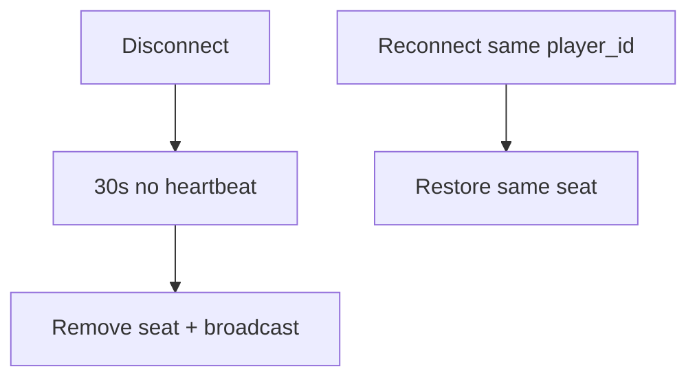

<!-- day-nav -->
[← Day 89 — Debrief: write-heavy mock](89-debrief-write-heavy-mock.md) · [Checklist →](../CHECKLIST.md)

# Day 90 — Mock: realtime lobby (kit run)

**Do now**

1. Set a timer.
2. Attempt the problem. Stop at the attempt barrier.
3. Then read.

## Time box

35 minutes for the attempt, then 10 minutes to score and log. The 10 minutes are not part of the interview clock. Do not use them to keep designing.

## Intent

Facing a realtime interview with no lesson beside it, leave able to run the kit's current problem (fallback: multiplayer lobby) and leave the design log as the only artifact.

## How to run

- Blank paper. No notes, no days 85–89 as a checklist of buzzwords, no search, no chat.
- **Preferred card:** if you own the separate interview kit, use its **current realtime** problem card only.
- **Fallback card (this book):** the [multiplayer lobby problem](../prompts/multiplayer-lobby.md) in the problem bank (`prompts/`). Use this if you do not own the kit. Do not block day 90 on a purchase.
- Do not scroll past the attempt barrier on **this** page until you have scored. If you used a kit card, still score with the rubric below, then read the lobby reference only as a comparable realtime shape — or skip the reference if the kit card was a different product and you will debrief from your log alone.
- This is not a chat history lecture (days 53–54), not WebRTC media deep dive, and not day 85 shopping. Design the lobby product on the card.
- Timer visible. At zero you stop, even mid-arrow.
- Score, then write the log from **your** page, then scroll.

Score what the product does. For the fallback lobby: how players create/join a room, presence, start match, reconnect, and what users see when the gateway or room authority dies. If presence has no TTL and duplicates can double-join seats, log the gap.

If you already scrolled, close the page. Run the mock tomorrow from memory, or it measures nothing.

Bring the **one rule** from day 89 into the room. Do not bring the day 88 reference.

## Timer

| Clock | You are doing | You are not doing |
|---|---|---|
| 0:00–5:00 | Create/join room, presence, start, reconnect. Non-goals. | Kit unboxing, chat product rewrite |
| 5:00–10:00 | Concurrent rooms, players/room, join QPS, message rate. Peak. | Article read QPS |
| 10:00–16:00 | API and keys: room_id, player_id, join idempotency, seat. | Exactly-once brand with no key |
| 16:00–28:00 | Gateway path vs room authority path. Presence TTL. | CDN static article design |
| 28:00–33:00 | Gateway drain or room authority down — user-visible. | Ignoring reconnect |
| 33:00–35:00 | What you did not build, and the 10× break. | A second product |

## Problem (fallback — multiplayer lobby)

Use this if you are not running a kit card:

> Design a multiplayer game lobby.
>
> Players create or join a room, see who is present, ready up, and start a match when the room is ready. Connections drop. Rooms are concurrent. Stay inside the time box.

If your kit card differs, that card wins. Still 35 minutes. Blank page. No notes.

## Rubric

Same six dimensions as day 7. Score 1–4 from your page only.

### Requirements

| Score | Anchor |
|---|---|
| 1 | Components first. No non-goals. |
| 2 | Behaviors listed. Constraints are adjectives. |
| 3 | Behavior, constraints, and non-goals locked. Questions would change seat limits or reconnect. |
| 4 | As a 3, and each non-goal is a product you refused, with a reason. |

### Estimates

| Score | Anchor |
|---|---|
| 1 | No numbers, or one QPS with no numerator. |
| 2 | Numbers exist. Units or assumptions are missing. |
| 3 | Concurrent rooms, players per room, join/leave rate, presence refresh. Peak. Assumptions spoken. |
| 4 | As a 3, plus the assumption you trust least, and a 10× move tied to a named limit. |

### API and data

| Score | Anchor |
|---|---|
| 1 | No API. The websocket brand is the model. |
| 2 | Endpoints/events exist. Join idempotency or seat key is vague. |
| 3 | Create/join/leave/ready/start. Real keys. Presence TTL. Double-join rule. |
| 4 | As a 3, plus reconnect that restores the same seat without cloning the player. |

### Design

| Score | Anchor |
|---|---|
| 1 | A technology tour, or boxes that ignore the numbers. |
| 2 | Plausible boxes with a global lock for every room, or presence with no expiry. |
| 3 | Smallest design that meets the numbers. Per-room authority, gateway fan-out, presence TTL, start fence. |
| 4 | As a 3, and you can say what players see when a peer disconnects mid-ready. |

### Deep dive

| Score | Anchor |
|---|---|
| 1 | You cannot go past the boxes. |
| 2 | Under a push, the answer is a product name. |
| 3 | One dive, with a choice and a cost. |
| 4 | The dive uses arithmetic or a concrete fault. You can name what it did not solve. |

### Failure and ops

| Score | Anchor |
|---|---|
| 1 | "We'll have replicas," and no user-visible behavior. |
| 2 | A dependency is named. Impact is fuzzy. |
| 3 | Gateway or room authority down. What players see. What still starts. What you page on. |
| 4 | As a 3, plus the crash window for double-start or ghost presence after mitigation. |

Do not average these into one vanity number. The log wants the six scores and **one** gap.

## Attempt first

Do the 35 minutes now on the kit card or the fallback problem.

When the timer stops:

1. Score the six dimensions from the anchors above. Evidence is a phrase on your paper.
2. Copy [design-log/TEMPLATE.md](../design-log/TEMPLATE.md) somewhere private. Fill it from your attempt. Scores are final once written.
3. Only then cross the barrier.

---

# Attempt barrier

You are about to read a reference design for the **multiplayer lobby fallback**.

If you ran a **different** kit card, you may stop here: your design log is the artifact. The reference below will not match your problem. Do not edit scores either way.

If your timer has not hit zero, go back up. If your design log is not filled, go back up.

---

## Reference design (multiplayer lobby fallback)

One legal design, at interview depth. Yours can differ and still be a 3. It is not a 3 if two tabs can occupy the same seat as two players, if presence never expires, if start can fire twice, or if reconnect always creates a second player.

### What this is not

Not days 53–54 full chat history product. Not live video (day 59). Not day 85 kit sales. Not authoritative game simulation / rollback netcode thesis. Lobby is **room membership + ready + start fence** with reconnect.

### Requirements

**In.** Create room, join by code, list presence, ready/unready, start when policy met (e.g. all ready and count in `[2, 8]`). Disconnect detection. Reconnect resumes the same `player_id` seat. Host migrate optional — say if you support it.

**Assumptions.** **100k** concurrent rooms peak. Average **4** players/room ⇒ **400k** presence sessions. Join/leave **500/s** average, **5k/s** peak. Presence heartbeat **every 10 s**. Room authority messages small (**≤ 1 KB**). Start must be **exactly one** match create per room.

**Out.** In-match simulation, matchmaking Elo service, voice chat, payment for cosmetics, cross-region seamless migrate mid-match.

**Codes.** Double join same user: one seat. Start twice: one match id. Ghost after disconnect: presence TTL **30 s** without heartbeat → remove and notify room.

### Estimates

Presence heartbeats: 400k / 10 s = **40k/s** updates — shard by `room_id`. Fan-out on ready: ×(n-1) per room; keep n small (≤8). 10× rooms breaks a single gateway process and a single room-service box — partition rooms.

### API and data

- HTTPS: `POST /rooms`, `POST /rooms/{id}/join` (idempotent with `player_id` or auth subject), `POST /rooms/{id}/start`
- WebSocket/gateway: `presence`, `ready`, `peer_joined`, `peer_left`, `starting`
- Data: `rooms(room_id, host, state, match_id?)`, `seats(room_id, player_id, ready, last_seen)`
- Room lock / version for start CAS

### Design

**Join path.** Auth → assign seat row unique on `(room_id, player_id)` → subscribe gateway to room channel → snapshot presence.

**Presence.** Heartbeat updates `last_seen`. Sweeper or lazy check on events: if `now - last_seen > 30s`, remove seat and broadcast leave.

**Start path.** CAS room `state: open → starting` with version; create `match_id` once; broadcast; hand off to match service (out of scope beyond the id). Retries of start return the same `match_id`.

**Gateway vs authority.** Gateways are stateless fan-out; **room authority** owns seat truth (process shard by room_id or row locks in DB). Do not let every gateway write seats without fencing.

**Reconnect.** Client reconnects with same credentials/`player_id`; snapshotted seat restored; no second seat.

### Failure the user sees

| Person | Gateway draining/down | Room authority shard down |
|---|---|---|
| Player connected elsewhere | Migrate WS; brief blip | Rooms on that shard: join/start 503; show "room unavailable" |
| Player in affected room | May need reconnect | Presence freezes; do not double-start from a client guess |
| Operator | Page gateway error rate | Page authority health + start CAS conflicts |

### Diagrams

Caption: "Start is a single CAS. Presence is heartbeats with TTL."

Caption: "Ghosts expire. Reconnect does not clone."

### Trade-offs

**DB row locks vs in-process room actors.** Operability vs join latency.

**Short presence TTL vs long.** Faster ghost cleanup vs flaky mobile false leaves.

**Client-predicted start vs server CAS.** Snappy UX vs double-match risk — prefer server fence.

### Say this in the room

A lobby is partitioned by room: gateways fan out, a room authority owns seats with unique `(room_id, player_id)`, presence dies after thirty seconds without a heartbeat, and start is a compare-and-swap so retries cannot create two matches. Reconnect restores the same seat. If the authority shard is down those rooms go unavailable instead of inventing membership on the client. That is the same honesty rule as ack-after-durable on the write-heavy day — success means the room state mutation landed.

### Staff depth

Day 90's artifact is the **design log**, not a certificate. Staff credit is reconnect without cloning, start fencing, and presence with a number — plus whatever one rule you carried from day 89.

**What staff sounds like.** Seat key. Presence TTL. Start CAS. Gateway vs authority. User-visible shard death.

### After you read this

One amendment line if you used the lobby fallback. Leave the scores alone.

You finished the 90 days when the day-90 log exists. Optional appendices in the curriculum are not extra days. The kit remains a separate product for further drills.

## Design log

Six scores and one gap. This entry is the course artifact.

---

<!-- day-nav -->
[← Day 89 — Debrief: write-heavy mock](89-debrief-write-heavy-mock.md) · [Checklist →](../CHECKLIST.md)
