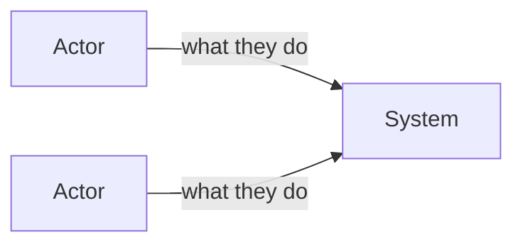
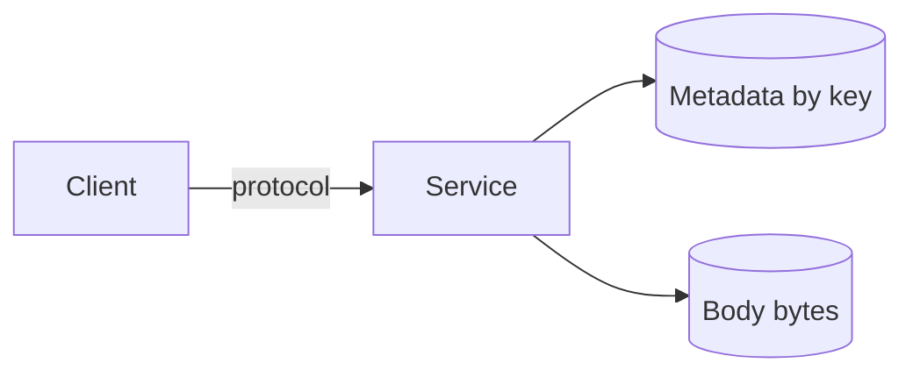
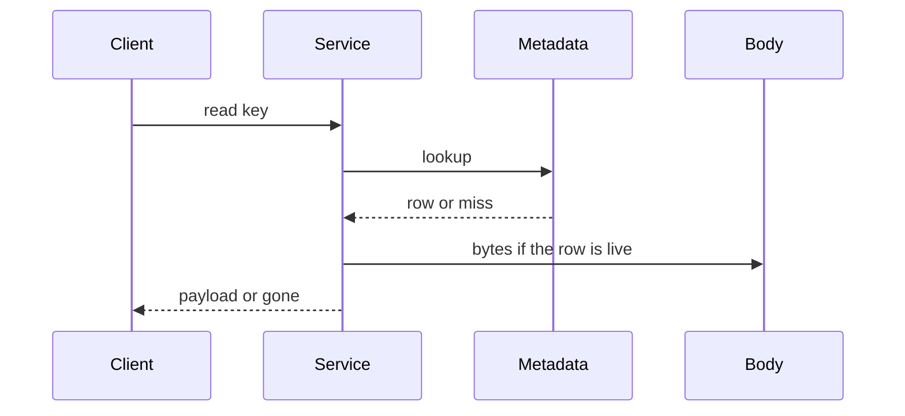
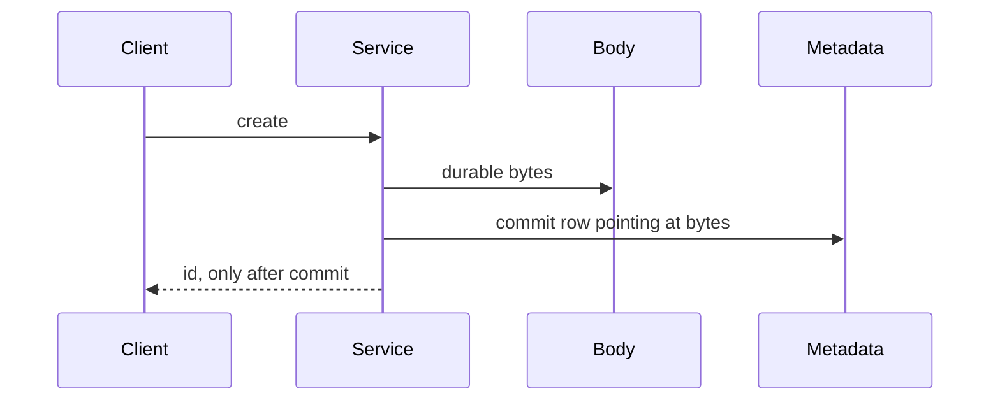
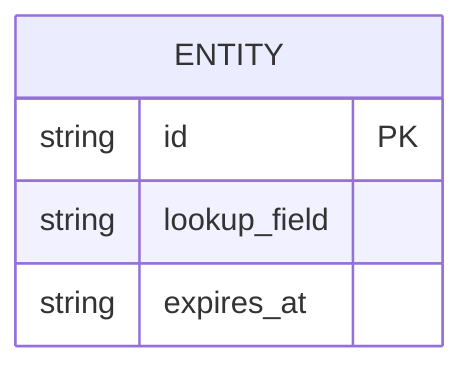
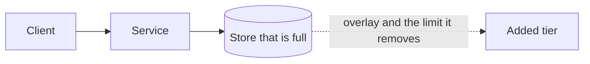
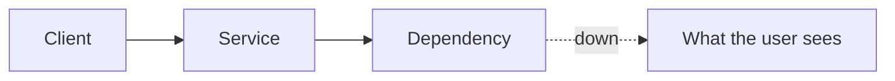

# Diagram stencils

Six types, used the same way every day. Week 1 fills them for the pastebin on [day 6](../days/06-a-diagram-that-survives.md). Later days only mark them up. If a figure needs a legend, it will not fit a whiteboard.

The kit, sold separately, should ship these blanks and not a seventh style. The filled pastebin is the example; it is not a stencil to memorize as a topology for other products.

Read path and write path are **one type, two drawings**. You will keep both, because a single tangled picture hides the question you are about to be asked.

Stores are named by access pattern, not by vendor. "Metadata by primary key" is a box. "Postgres" is a word you may say after the box exists. "Kafka" is not a stencil.

## The six

1. **Context.** Actors and the trust boundary. Who is outside the system, what they are allowed to do, what is untrusted.
2. **Whiteboard.** Few boxes, labeled arrows. The picture you can redraw in two minutes.
3. **Read path and write path.** Separate sequences. Include the check that returns "gone" and the durability point on the write.
4. **Data model.** Entities, the lookup key, indexes you will actually serve, retention. Before any scaling overlay.
5. **Scale overlay.** The replica, shard, cache, or queue, and the **bottleneck it removes**. Drawn only when a number or a 10× question demands it. An overlay on a calm design, not a new product.
6. **Failure overlay.** One dependency down. Retry, queue, or the user-visible result. One failure per drawing.

## Blank templates

Copy into a scratch file. Leave them blank during a mock.

### 1. Context

### 2. Whiteboard

### 3a. Read path

### 3b. Write path

### 4. Data model

### 5. Scale overlay

Mark the overlay as not built until the number exists. Write the limit on the arrow.

### 6. Failure overlay

One dependency. Name durability (what is already safe) separately from availability (what fails right now).

## Kit hookup

One note, not the kit: the blanks above are the contract. A future stencil pack should not add a "microservices" blank or a vendor legend. Day 6 is the filled example for the pastebin only.
